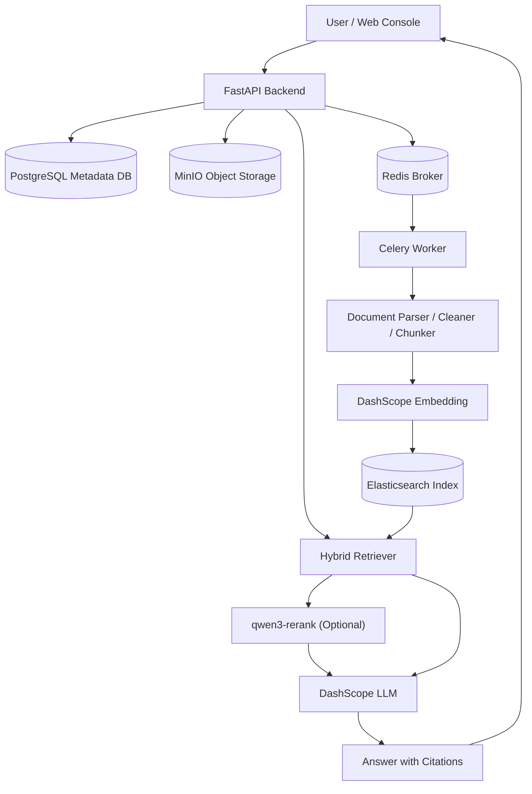

<div align="center">

# RAG Builder

**Local-first RAG infrastructure for document ingestion, hybrid retrieval, grounded answers, evaluation, and observability.**

RAG Builder 是一个本地可运行的轻量级企业知识库 RAG 系统，支持文档上传、异步解析、向量检索、Rerank 重排、引用溯源、RAG 评测和 Web 控制台。

[](https://www.python.org/)
[](https://fastapi.tiangolo.com/)
[](https://www.elastic.co/elasticsearch)
[](https://docs.docker.com/compose/)
[](LICENSE)

[Demo Preview](#demo-preview) · [Features](#features) · [Architecture](#architecture) · [Quick Start](#quick-start) · [Documentation](#documentation)

</div>

---

## Demo Preview

> Screenshots and a demo video will be added after the first public demo recording.

<!--
Recommended media locations:
- docs/assets/demo.gif
- docs/assets/demo-cover.png
- docs/assets/rag-builder-preview.png

For a longer video, upload it to GitHub Releases, YouTube, or Bilibili,
then replace this comment with a linked cover image.
-->

The demo will cover the complete local workflow:

```text
Upload document
-> Async parsing and embedding
-> Hybrid retrieval and optional rerank
-> Grounded answer with citations
-> Offline evaluation and system inspection
```

## Features

- **Document ingestion** with PDF / TXT validation, SHA-256 deduplication, and MinIO object storage
- **Async parsing pipeline** powered by Celery and Redis
- **Metadata persistence** and task observability with PostgreSQL
- **Text parsing and chunking** with source metadata and stable trace fields
- **DashScope Embedding** through an OpenAI-compatible client
- **Hybrid retrieval** combining Elasticsearch vector and keyword search
- **Optional qwen3-rerank** for retrieval debugging and configurable answer reranking
- **Grounded answer generation** with `citations` and backward-compatible `sources`
- **Intent-aware responses** for grounded, unanswerable, and chitchat requests
- **Retrieval debug console** for baseline / rerank comparison
- **Offline RAG evaluation** for retrieval, answer quality, citations, and abstention
- **FastGPT-style Web workspace** built with native HTML, CSS, and JavaScript
- **Health and dependency dashboard** for infrastructure, Worker, and model configuration

## Screenshots

> Image placeholders are reserved. Add release screenshots to [`docs/assets/`](docs/assets/) before publishing.

### Knowledge Workspace

<!-- Add: docs/assets/workspace.png -->

The overview for knowledge assets, document activity, evaluation summaries, and runtime status.

### RAG Chat with Citations

<!-- Add: docs/assets/rag-chat.png -->

The answer workspace with grounded responses and source evidence.

### Retrieval Debug

<!-- Add: docs/assets/retrieval-debug.png -->

Baseline hybrid retrieval and optional qwen3-rerank comparison.

### Evaluation Report

<!-- Add: docs/assets/evaluation-report.png -->

Offline retrieval, answer, citation, and abstention metrics.

### System Status

<!-- Add: docs/assets/system-status.png -->

Dependency health, Worker activity, and model configuration visibility.

## Architecture

RAG Builder separates request handling, asynchronous document processing, structured metadata, object storage, and retrieval data. Upload requests return after task dispatch instead of waiting for parsing and embedding to finish.



Document lifecycle:

```text
PENDING -> PARSING -> SUCCESS
                    -> FAILED
```

Detailed design: [Project Architecture](docs/architecture/project_architecture.md) · [RAG Pipeline](docs/architecture/rag_pipeline.md)

## Tech Stack

| Layer | Technology | Responsibility |
|---|---|---|
| API | FastAPI, Uvicorn, Pydantic | HTTP APIs, validation, Web console entry |
| Metadata | PostgreSQL, SQLAlchemy | Documents, statuses, and task logs |
| Object Storage | MinIO | Original PDF / TXT files |
| Async Processing | Redis, Celery | Task dispatch and document processing |
| Retrieval | Elasticsearch 8.11.1 | Chunks, vectors, keyword and KNN search |
| Models | DashScope, Qwen | Embedding, rerank, and answer generation |
| Parsing | pypdf, PyMuPDF | PDF / TXT content extraction |
| Chunking | langchain-text-splitters | Recursive text splitting |
| Console | HTML, CSS, JavaScript | Local workspace and diagnostics |
| Infrastructure | Docker Compose | Local service orchestration |

## Quick Start

### Prerequisites

- Python 3.10+
- Docker Desktop
- A DashScope-compatible API key
- Windows PowerShell

### 1. Clone and install

```powershell
git clone https://github.com/hf007019-lgtm/rag-builder.git
cd rag-builder

python -m venv .venv
.\.venv\Scripts\Activate.ps1
python -m pip install -r requirements.txt
```

### 2. Configure the environment

```powershell
Copy-Item .env.example .env
```

Update `.env` with your own API key. Never commit this file.

### 3. Start local dependencies

```powershell
docker compose up -d
python scripts/check_env.py
python scripts/init_db.py
```

### 4. Start the API

```powershell
uvicorn app.main:app --reload --host 127.0.0.1 --port 18000
```

### 5. Start the Celery Worker

Open another PowerShell window, activate the same virtual environment, then run:

```powershell
python -m celery -A worker.celery_app.celery_app worker --loglevel=info --pool=solo
```

Open the Web console:

```text
http://127.0.0.1:18000
```

Swagger:

```text
http://127.0.0.1:18000/docs
```

See [Local Start Guide](docs/operations/local_start.md) for the complete workflow.

## Environment Variables

Copy `.env.example` to `.env` and update the local values:

| Variable | Description |
|---|---|
| `DATABASE_URL` | PostgreSQL SQLAlchemy connection URL |
| `POSTGRES_PASSWORD` | Local PostgreSQL initialization password |
| `MINIO_ENDPOINT` | MinIO API endpoint |
| `MINIO_ACCESS_KEY` | MinIO local access key |
| `MINIO_SECRET_KEY` | MinIO local secret key |
| `MINIO_BUCKET_NAME` | Bucket for original documents |
| `REDIS_URL` | Redis broker and result backend URL |
| `ES_URL` | Elasticsearch URL |
| `ES_INDEX_NAME` | Elasticsearch chunk index |
| `ES_VECTOR_DIMS` | Embedding vector dimensions |
| `LLM_BASE_URL` | OpenAI-compatible model endpoint |
| `LLM_API_KEY` | DashScope-compatible Embedding / Chat API key |
| `DASHSCOPE_API_KEY` | Optional dedicated API key for rerank |
| `EMBEDDING_MODEL_NAME` | Embedding model name |
| `CHAT_MODEL_NAME` | Chat model name |
| `RERANK_ENABLED` | Enable rerank by default |
| `RERANK_MODEL_NAME` | Rerank model name |
| `RERANK_APPLY_TO_ASK` | Apply rerank to the production ask flow |

The committed [.env.example](.env.example) contains placeholders and local development defaults only.

## Web Console

The built-in Web console includes:

- **Knowledge workspace** for overall knowledge-base activity
- **Document collection** for status, task logs, retry, and deletion
- **Upload and parsing pipeline** for PDF / TXT ingestion
- **RAG chat playground** for grounded knowledge-base questions
- **Citation evidence panel** with source file, chunk, page, and score
- **Retrieval debug page** for Hybrid baseline and rerank comparison
- **Evaluation report page** for the latest offline metrics
- **System status dashboard** for dependencies, Worker, and model configuration
- **API debug entry** linking to FastAPI Swagger

The console is served directly by FastAPI and does not require a separate frontend build.

## API Example

Ask a knowledge-base question:

```powershell
$body = @{
    question = "RAG Builder 如何处理上传后的文档？"
} | ConvertTo-Json

Invoke-RestMethod `
    -Method Post `
    -Uri "http://127.0.0.1:18000/api/v1/search/ask" `
    -ContentType "application/json" `
    -Body $body
```

Example response shape:

```json
{
  "answer": "基于知识库上下文生成的回答",
  "answer_type": "grounded",
  "used_retrieval": true,
  "citations": [
    {
      "doc_id": 15,
      "file_name": "example.pdf",
      "chunk_id": "doc_15_chunk_0",
      "page_number": 1,
      "chunk_text": "用于支撑回答的原文片段",
      "score": 4.12
    }
  ],
  "sources": [
    {
      "doc_id": 15,
      "file_name": "example.pdf",
      "chunk_id": "doc_15_chunk_0",
      "page_number": 1,
      "chunk_text": "用于支撑回答的原文片段",
      "score": 4.12
    }
  ]
}
```

Full endpoint reference: [API Overview](docs/architecture/api_overview.md)

## RAG Evaluation

Run the offline evaluation scripts:

```powershell
python evals/run_retrieval_eval.py
python evals/run_answer_eval.py
```

Compare baseline retrieval with qwen3-rerank:

```powershell
python evals/run_retrieval_eval.py --use-rerank --top-k 3 --top-n 30
```

Generated artifacts:

```text
evals/eval_report.md
evals/eval_results.json
```

The report is generated from fixed test cases and the current local knowledge base. It does **not** update automatically when users ask questions in the Web console. A zero score can indicate an empty index or a mismatch between evaluation cases and indexed documents; it does not by itself prove that the whole system is broken.

More details: [RAG Evaluation Guide](docs/evaluation/rag_evaluation.md)

## Project Structure

```text
rag_builder/
├── app/
│   ├── api/v1/             # FastAPI routes
│   ├── core/               # Configuration and constants
│   ├── db/                 # PostgreSQL and MinIO clients
│   ├── models/             # SQLAlchemy models
│   ├── schemas/            # Pydantic schemas
│   ├── services/           # Ingestion, retrieval, answer, health
│   └── static/             # Built-in Web console
├── worker/
│   ├── pipeline/           # Parse, clean, enrich, ingest
│   └── deepdoc/            # Chunking, Embedding, Elasticsearch
├── evals/                  # Cases, scripts, and offline reports
├── docs/
│   ├── architecture/
│   ├── operations/
│   ├── evaluation/
│   └── assets/             # Future screenshots and demo media
├── scripts/
├── docker-compose.yml
├── .env.example
└── README.md
```

## Roadmap

- [ ] Add stable MinIO object names and idempotent Elasticsearch writes
- [ ] Add more document parsers and OCR support
- [ ] Add automated unit and API tests
- [ ] Add Web-triggered evaluation jobs
- [ ] Add multi-knowledge-base management
- [ ] Add user authentication and permissions for the Web console
- [ ] Add Docker image packaging and deployment guidance
- [ ] Add demo video, GIF, and release screenshots

## Security Notes

- Do not commit `.env`, real API keys, production passwords, or private source documents.
- Use `.env.example` as the public configuration template.
- Review and sanitize documents before uploading sensitive files.
- Treat bundled evaluation data and local sample data as development-only assets.
- Rotate credentials immediately if a real secret is ever committed.
- Review cross-storage deletion and retry behavior before production deployment.

## Documentation

- [Project Overview](docs/architecture/project_overview.md)
- [Project Architecture](docs/architecture/project_architecture.md)
- [RAG Pipeline](docs/architecture/rag_pipeline.md)
- [API Overview](docs/architecture/api_overview.md)
- [Local Start Guide](docs/operations/local_start.md)
- [Testing Guide](docs/operations/testing.md)
- [Troubleshooting](docs/operations/troubleshooting.md)
- [RAG Evaluation](docs/evaluation/rag_evaluation.md)
- [Current Stage Summary](docs/architecture/stage_summary_current.md)

## License

This project is licensed under the [MIT License](LICENSE).
