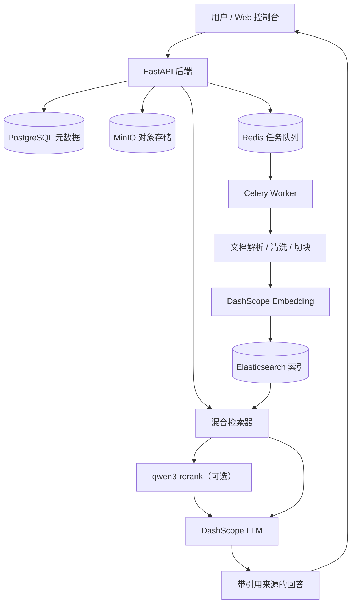

<div align="center">

# RAG Builder

<strong>一个本地可运行的轻量级企业知识库 RAG 工程系统</strong>

<br />
<br />

从文档上传、异步解析、向量检索，到 Rerank、引用溯源、离线评测与 Web 控制台，完整串联一条可理解、可调试、可继续扩展的 RAG 工程链路。

<br />


</div>

---

## 快速导航

| 内容 | 说明 |
|---|---|
| [项目介绍](#什么是-rag-builder) | 了解项目定位与完整工程链路 |
| [核心能力](#rag-builder-核心能力) | 查看当前已经实现的主要功能 |
| [演示预览](#演示预览) | 后续演示视频与截图的预留位置 |
| [系统架构](#系统架构) | 了解后端组件及数据流向 |
| [快速开始](#快速开始) | 在 Windows PowerShell 中本地运行 |
| [RAG 评测](#rag-评测) | 运行检索、回答和引用离线评测 |
| [常见问题](docs/operations/troubleshooting.md) | 排查本地依赖、Worker 与模型配置 |

## 什么是 RAG Builder？

RAG Builder 是一个面向企业知识库场景的 RAG 后端系统，用于将 PDF、TXT 文档上传、保存、解析、切分、向量化并写入检索引擎，再通过混合检索和大模型生成带引用来源的回答。

它覆盖的不只是“向量检索 + 调用大模型”，而是一条完整的本地工程链路：

```text
文档上传
-> MinIO 保存原文件
-> PostgreSQL 创建文档记录
-> Redis / Celery 投递异步任务
-> 文档解析、清洗与 Chunk 切分
-> DashScope Embedding
-> Elasticsearch 入库
-> 向量 + 关键词混合检索
-> 可选 qwen3-rerank 重排
-> DashScope LLM 生成回答
-> Citations 引用溯源
-> 离线 RAG 评测
```

项目保持清晰的系统边界：FastAPI 负责同步 API 与业务编排，Celery Worker 负责耗时文档处理，PostgreSQL、MinIO、Redis 和 Elasticsearch 分别承担元数据、原文件、任务队列和检索数据的存储职责。

## 为什么需要一个完整的 RAG 工程系统？

很多 RAG 示例可以快速完成“上传文档、向量检索、生成回答”，但真正把链路持续运行起来，还需要回答更多工程问题：

- 文档上传后处于什么状态，失败后能否查询原因？
- 解析、切块和 Embedding 是否会阻塞 Web 请求？
- 原始文件、结构化元数据和向量应该分别保存在哪里？
- 检索结果是否能追溯到文档、Chunk 和页码？
- 知识库没有依据时，模型是否会明确拒答？
- Rerank 是否真的改善了结果，还是只增加了调用成本？
- 如何用固定问题集衡量召回率、引用覆盖和拒答行为？
- PostgreSQL、MinIO、Redis、Elasticsearch 和 Worker 是否健康？
- 开发者如何在一个控制台中观察、调试和验证整条链路？

RAG Builder 的目标，是把这些问题放回同一个工程上下文中处理，而不是只展示一次成功的模型调用。

## 普通 RAG 示例的常见缺口

| 常见缺口 | RAG Builder 的处理方式 |
|---|---|
| 上传请求同步执行完整解析 | 使用 Redis + Celery 异步处理，API 快速返回 `doc_id` |
| 原文件直接塞入数据库 | MinIO 保存原文件，PostgreSQL 只保存元数据 |
| 只有成功结果，没有任务状态 | 使用 `PENDING / PARSING / SUCCESS / FAILED` 状态流转 |
| 检索命中不可解释 | 返回文件名、Chunk、页码、原文片段和检索得分 |
| 回答没有引用约束 | 返回标准 `citations`，同时保留兼容字段 `sources` |
| 没有依据仍然生成答案 | 使用 `unanswerable` 类型和固定拒答策略 |
| Rerank 效果无法验证 | 提供 baseline / rerank 检索调试和离线对比 |
| 没有质量评估入口 | 提供检索、回答、引用与拒答评测脚本 |
| 依赖故障难以定位 | 提供依赖健康检查、Worker 活性与系统状态页面 |

## RAG Builder 核心能力

- **文档入库**：PDF / TXT 校验、空文件检查、SHA-256 内容查重
- **对象存储**：使用 MinIO 保存原始文档
- **异步流水线**：使用 Redis 和 Celery 执行解析、清洗、切块与入库
- **元数据管理**：使用 PostgreSQL 保存文档状态和任务日志
- **文本向量化**：通过 OpenAI 兼容客户端调用 DashScope Embedding
- **混合检索**：结合 Elasticsearch KNN 向量检索与关键词匹配
- **语义重排**：可选调用 `qwen3-rerank` 对候选结果重新排序
- **知识问答**：基于检索上下文调用 DashScope LLM
- **引用溯源**：返回 `citations`、`sources`、页码、Chunk 和原文片段
- **意图处理**：区分 `grounded`、`unanswerable` 和 `chitchat`
- **检索调试**：在控制台对比 baseline 与 rerank 结果
- **离线评测**：评估召回、排序、回答、引用和拒答行为
- **Web 控制台**：提供知识库、上传、问答、调试、评测和状态页面
- **运行观测**：检查基础依赖、Celery Worker 和模型配置状态

## 演示预览

> 首次公开演示录制完成后，将在这里补充演示视频、GIF 或视频封面。

<!--
建议的视频与封面位置：
- docs/assets/demo.mp4
- docs/assets/demo.gif
- docs/assets/demo-cover.png

较长视频可上传至 GitHub Releases、YouTube 或 Bilibili，
再在此处添加视频封面和外部链接。
-->

计划展示以下完整流程：

```text
上传文档
-> 查看异步解析状态
-> 检索并对比 Rerank
-> 发起 RAG 问答
-> 查看引用来源
-> 查看离线评测与系统状态
```

## 功能截图

> 截图位置已预留。正式发布前可将图片放入 [`docs/assets/`](docs/assets/)，图片规划与生成描述见 [图片素材说明](docs/assets/image_prompts.md)。

### 1. 知识库工作台

<!-- docs/assets/knowledge-workspace.png -->

展示知识库概览、文档统计、最近活动、评测摘要和运行状态。

### 2. 带引用的 RAG 问答

<!-- docs/assets/rag-chat-citations.png -->

展示知识库回答、回答类型以及包含文档名、Chunk、页码和原文的引用面板。

### 3. 检索与重排调试

<!-- docs/assets/retrieval-debug.png -->

展示查询参数、baseline 检索结果、qwen3-rerank 结果和排序分数。

### 4. RAG 评测报告

<!-- docs/assets/evaluation-report.png -->

展示召回率、精确率、MRR、引用覆盖、拒答率和失败用例。

### 5. 系统状态面板

<!-- docs/assets/system-status.png -->

展示 PostgreSQL、MinIO、Redis、Elasticsearch、Celery Worker 和模型配置状态。

### 6. 上传与解析流水线

<!-- docs/assets/upload-pipeline.png -->

展示文档上传、任务状态、Chunk 数量、处理日志和失败原因。

## 系统架构

上传接口只完成必要的同步操作：校验文件、写入原文件、创建 `PENDING` 文档记录并投递 Celery 任务。解析、切块、Embedding 和 Elasticsearch 入库由 Worker 在后台完成。



组件职责：

| 组件 | 主要职责 |
|---|---|
| FastAPI | HTTP 接口、同步业务编排和 Web 控制台入口 |
| PostgreSQL | 文档元数据、状态和任务日志 |
| MinIO | PDF / TXT 原始文件 |
| Redis | Celery Broker 与 Result Backend |
| Celery Worker | 解析、清洗、切块、Embedding 和入库 |
| Elasticsearch | Chunk、向量、关键词和混合检索 |
| DashScope | Embedding、Chat 和可选 Rerank |

详细说明：[系统架构](docs/architecture/project_architecture.md) · [项目全景](docs/architecture/project_overview.md)

## RAG 流水线

### 文档入库阶段

```mermaid
flowchart LR
    Upload["上传 PDF / TXT"] --> Validate["校验与 SHA-256 查重"]
    Validate --> Object["原文件写入 MinIO"]
    Object --> Pending["PostgreSQL 创建 PENDING 记录"]
    Pending --> Queue["任务投递到 Redis"]
    Queue --> Parse["Celery 解析与清洗"]
    Parse --> Chunk["文本切分与元数据补充"]
    Chunk --> Vector["生成 Embedding"]
    Vector --> Index["写入 Elasticsearch"]
    Index --> Success["更新 SUCCESS 与任务日志"]
```



文档状态按以下路径流转：

```text
PENDING -> PARSING -> SUCCESS
                    -> FAILED
```

### 检索问答阶段

```text
用户问题
-> 判断是否需要检索
-> 生成问题向量
-> Elasticsearch 混合检索
-> 相关性过滤
-> 可选 qwen3-rerank
-> 组织知识库上下文
-> 调用 Chat 模型
-> 返回 answer + citations + sources
```

更完整的数据流说明见 [RAG 流水线文档](docs/architecture/rag_pipeline.md)。

## 检索与 Rerank

基础检索同时使用：

- Elasticsearch KNN 向量检索
- `chunk_text` 关键词匹配
- 文件类型与相关性过滤
- 最高分文档候选筛选

`qwen3-rerank` 是可选能力。当前可用于独立检索调试和显式启用的离线评测，也可以通过配置决定是否应用到正式问答链路。

```text
Hybrid baseline 候选
-> qwen3-rerank 语义重排
-> 返回新的排序、得分和耗时
-> 调用失败时回退 baseline
```

项目不会仅凭接入 Rerank 就宣称效果提升。是否启用正式问答重排，应基于固定知识库和固定评测集验证。

## 引用约束

问答响应返回两组引用字段：

- `citations`：标准引用字段
- `sources`：为已有调用方保留的兼容字段

每条引用可包含：

| 字段 | 含义 |
|---|---|
| `doc_id` | 来源文档 ID |
| `file_name` | 来源文件名 |
| `chunk_id` | 命中的文本块 ID |
| `page_number` | PDF 页码，TXT 可为空 |
| `chunk_text` | 用于支撑回答的原文片段 |
| `score` | 检索或排序得分 |

引用内容来自后端检索结果，不由模型自行编造。检索依据不足时，系统返回 `unanswerable`，并清空引用列表。

## RAG 评测

项目提供两类离线评测：

1. **检索评测**：`hit_rate@k`、`recall@k`、`precision@k`、MRR、检索耗时和 Rerank 对比。
2. **回答评测**：引用覆盖、预期结论命中、弱支持语句检查、回答类型和不可回答问题拒答率。

运行评测：

```powershell
python evals/run_retrieval_eval.py
python evals/run_answer_eval.py
```

对比 baseline 与 qwen3-rerank：

```powershell
python evals/run_retrieval_eval.py --use-rerank --top-k 3 --top-n 30
```

评测产物：

```text
evals/eval_report.md
evals/eval_results.json
```

评测报告来自固定测试用例和当前本地知识库，**不会随着 Web 控制台中的普通问答自动更新**。指标为 0 可能表示索引为空，或评测用例与当前知识库不匹配，不能直接解释为整个系统故障。

详细说明见 [RAG 评测文档](docs/evaluation/rag_evaluation.md)。

## Web 控制台

FastAPI 内置原生 HTML、CSS、JavaScript 控制台，不需要额外安装前端工程。

当前页面包括：

- **全部知识库**：查看文档、评测和运行状态概览
- **文档集合**：查询文档状态、任务日志、重试和删除
- **上传解析**：上传 PDF / TXT 并观察异步处理状态
- **RAG 问答**：基于知识库提问并查看引用证据
- **检索调试**：对比 Hybrid baseline 与 Rerank 结果
- **评测报告**：读取最近一次离线评测产物
- **系统状态**：查看依赖、Worker 和模型配置
- **API 调试**：打开 FastAPI Swagger

本地访问：

```text
http://127.0.0.1:18000
```

## 技术栈

| 层次 | 技术 | 作用 |
|---|---|---|
| Web API | FastAPI、Uvicorn、Pydantic | 接口、校验与控制台入口 |
| 元数据 | PostgreSQL、SQLAlchemy | 文档状态与任务日志 |
| 对象存储 | MinIO | 原始文档保存 |
| 异步任务 | Redis、Celery | 任务投递与后台处理 |
| 检索引擎 | Elasticsearch 8.11.1 | Chunk、向量和混合检索 |
| 模型服务 | DashScope、Qwen | Embedding、Rerank 与回答生成 |
| 文档解析 | pypdf、PyMuPDF | PDF / TXT 内容提取 |
| 文本切分 | langchain-text-splitters | 递归 Chunk 切分 |
| Web 控制台 | HTML、CSS、JavaScript | 本地工作台与调试页面 |
| 本地编排 | Docker Compose | 基础依赖启动 |

## 快速开始

### 环境要求

- Python 3.10+
- Docker Desktop
- 可用的 DashScope API Key
- Windows PowerShell

### 1. 克隆并安装依赖

```powershell
git clone https://github.com/hf007019-lgtm/rag-builder.git
cd rag-builder

python -m venv .venv
.\.venv\Scripts\activate
python -m pip install -r requirements.txt
```

### 2. 创建本地配置

```powershell
Copy-Item .env.example .env
```

编辑 `.env`，填写自己的模型 API Key。不要把 `.env` 提交到 Git。

### 3. 启动本地依赖

```powershell
docker compose up -d
python scripts/check_env.py
python scripts/init_db.py
```

### 4. 启动 FastAPI

```powershell
uvicorn app.main:app --reload --host 127.0.0.1 --port 18000
```

### 5. 启动 Celery Worker

在另一个已激活虚拟环境的 PowerShell 窗口运行：

```powershell
python -m celery -A worker.celery_app.celery_app worker --loglevel=info --pool=solo
```

访问地址：

```text
Web 控制台：http://127.0.0.1:18000
Swagger：http://127.0.0.1:18000/docs
```

完整步骤见 [本地启动指南](docs/operations/local_start.md)。

## 环境变量

将 `.env.example` 复制为 `.env` 后，按本地环境修改：

| 变量 | 说明 |
|---|---|
| `DATABASE_URL` | PostgreSQL SQLAlchemy 连接地址 |
| `POSTGRES_PASSWORD` | Compose 初始化 PostgreSQL 的本地密码 |
| `MINIO_ENDPOINT` | MinIO API 地址 |
| `MINIO_ACCESS_KEY` | MinIO 本地访问账号 |
| `MINIO_SECRET_KEY` | MinIO 本地访问密码 |
| `MINIO_BUCKET_NAME` | 原始文档 Bucket |
| `REDIS_URL` | Redis Broker / Result Backend 地址 |
| `ES_URL` | Elasticsearch 地址 |
| `ES_INDEX_NAME` | Elasticsearch Chunk 索引名 |
| `ES_VECTOR_DIMS` | Embedding 向量维度 |
| `LLM_BASE_URL` | OpenAI 兼容模型服务地址 |
| `LLM_API_KEY` | Embedding / Chat API Key |
| `DASHSCOPE_API_KEY` | 可选的独立 Rerank API Key |
| `EMBEDDING_MODEL_NAME` | Embedding 模型名 |
| `CHAT_MODEL_NAME` | Chat 模型名 |
| `RERANK_ENABLED` | 是否默认启用 Rerank |
| `RERANK_MODEL_NAME` | Rerank 模型名 |
| `RERANK_APPLY_TO_ASK` | 是否将 Rerank 应用到正式问答 |

仓库中的 [.env.example](.env.example) 只包含占位符和本地开发默认值。

## API 示例

调用知识库问答接口：

```powershell
$body = @{
    question = "RAG Builder 如何处理上传后的文档？"
} | ConvertTo-Json

Invoke-RestMethod `
    -Method Post `
    -Uri "http://127.0.0.1:18000/api/v1/search/ask" `
    -ContentType "application/json" `
    -Body $body
```

响应结构示例：

```json
{
  "answer": "基于知识库上下文生成的回答",
  "answer_type": "grounded",
  "used_retrieval": true,
  "citations": [
    {
      "doc_id": 15,
      "file_name": "example.pdf",
      "chunk_id": "doc_15_chunk_0",
      "page_number": 1,
      "chunk_text": "用于支撑回答的原文片段",
      "score": 4.12
    }
  ],
  "sources": [
    {
      "doc_id": 15,
      "file_name": "example.pdf",
      "chunk_id": "doc_15_chunk_0",
      "page_number": 1,
      "chunk_text": "用于支撑回答的原文片段",
      "score": 4.12
    }
  ]
}
```

完整接口见 [API 概览](docs/architecture/api_overview.md)。

## 项目结构

```text
rag_builder/
├── app/
│   ├── api/v1/             # FastAPI 路由
│   ├── core/               # 配置、常量与代理处理
│   ├── db/                 # PostgreSQL 与 MinIO 客户端
│   ├── models/             # SQLAlchemy 模型
│   ├── schemas/            # Pydantic 请求与响应模型
│   ├── services/           # 上传、检索、问答、状态服务
│   └── static/             # 内置 Web 控制台
├── worker/
│   ├── pipeline/           # 解析、清洗、元数据与入库
│   └── deepdoc/            # 切块、Embedding、Elasticsearch
├── evals/                  # 评测用例、脚本与离线报告
├── docs/
│   ├── architecture/       # 架构与项目全景
│   ├── operations/         # 启动、测试与排错
│   ├── evaluation/         # 评测说明
│   └── assets/             # 截图、视频封面与图片规划
├── scripts/
├── docker-compose.yml
├── .env.example
└── README.md
```

## 后续规划

- [ ] 为 MinIO 增加稳定唯一的对象名
- [ ] 完善 Elasticsearch 重试幂等和失败补偿
- [ ] 增加更多文档解析器与 OCR 支持
- [ ] 增加 pytest 单元测试和 FastAPI 接口测试
- [ ] 增加由 Web 控制台触发的评测任务
- [ ] 增加多知识库管理
- [ ] 增加 Web 控制台用户认证与权限
- [ ] 增加 Docker 镜像打包与部署指南
- [ ] 补充演示视频、GIF 和正式功能截图

## 安全说明

- 不要提交 `.env`、真实 API Key、生产密码或私有原始文档。
- 使用 `.env.example` 作为公开配置模板。
- 上传前检查并脱敏可能包含隐私或内部信息的文档。
- 仓库内的评测数据和本地样例只用于开发验证。
- 如果真实密钥曾进入 Git，应立即轮换，不能只删除当前文件内容。
- 生产使用前应进一步完善权限、文件限制、任务幂等和跨存储补偿。

## 相关文档

- [项目全景](docs/architecture/project_overview.md)
- [系统架构](docs/architecture/project_architecture.md)
- [RAG 流水线](docs/architecture/rag_pipeline.md)
- [API 概览](docs/architecture/api_overview.md)
- [本地启动](docs/operations/local_start.md)
- [本地测试](docs/operations/testing.md)
- [常见问题](docs/operations/troubleshooting.md)
- [RAG 评测](docs/evaluation/rag_evaluation.md)
- [当前阶段总结](docs/architecture/stage_summary_current.md)

## 开源协议

本项目使用 [MIT License](LICENSE)。
