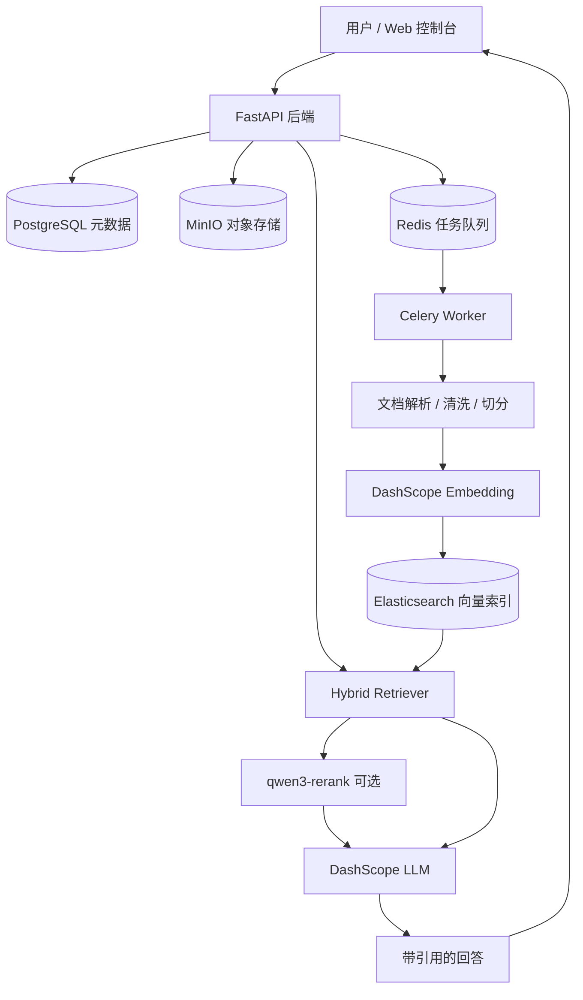
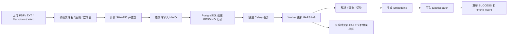

# RAG Builder

一个本地可运行的轻量级企业知识库 RAG 工程系统，把文档入库、异步解析、混合检索、重排、问答、引用溯源、离线评测和 Web 控制台串成一条可观察、可调试、可扩展的工程链路。


## 项目简介

RAG Builder 是一个面向企业知识库场景的 RAG 后端系统。它不是只演示“向量检索 + 大模型回答”的最小脚本，而是把真实知识库系统中会遇到的文档管理、对象存储、异步任务、状态追踪、检索调试、引用溯源和离线评测一起放进同一个本地工程里。

当前系统支持单文件上传和批量上传 PDF / TXT / Markdown / Word(.docx) 文档，原文件保存到 MinIO，文档状态和任务日志保存到 PostgreSQL，解析、清洗、切分和 Embedding 由 Redis + Celery 异步执行，chunk 与向量写入 Elasticsearch。问答阶段使用 Elasticsearch 混合检索，可选接入 `qwen3-rerank` 重排，再由 DashScope OpenAI 兼容接口调用 LLM 生成带引用来源的回答。

这个项目适合用来展示一个 RAG 系统从“能回答”走向“可管理、可追踪、可评测、可扩展”的工程化过程。

## 为什么不是普通 RAG Demo

很多 RAG Demo 能快速跑通一次问答，但往往只覆盖最亮眼的一小段链路：把文档切块，生成向量，检索 Top K，然后把上下文交给大模型。这样的 Demo 适合解释概念，却很难回答真实系统中的关键问题：文档导入失败怎么办，解析任务在哪里看，原文件放在哪里，重复上传如何处理，检索结果为什么命中，回答依据来自哪一页，知识库没有依据时是否应该拒答，Rerank 是否真的改善效果，以及系统依赖是否健康。

普通 RAG Demo 常见问题包括：

- 只做向量检索，缺少关键词匹配、过滤和重排对比。
- 文档导入依赖手写脚本，缺少上传接口和文档管理。
- 没有异步解析，上传请求容易被解析、Embedding 和入库阻塞。
- 没有状态追踪，无法观察 `PENDING -> PARSING -> SUCCESS/FAILED`。
- 没有引用溯源，回答看起来像是模型“自己知道”的。
- 没有无依据拒答，知识库缺失时仍可能强行生成。
- 没有检索调试入口，难以解释 chunk、score、baseline 和 rerank 差异。
- 没有固定评测体系，只能凭主观感觉判断效果。
- 没有系统状态面板，依赖故障定位成本高。

RAG Builder 的工程价值在于：它把这些“Demo 之外的问题”变成系统的一等公民，让 RAG 不只是一次模型调用，而是一条可以被开发、调试、观察和迭代的后端链路。

## RAG Builder 不只是普通 RAG Demo

<!-- TODO: add docs/assets/rag-demo-comparison.png -->

| 对比维度 | 典型 RAG Demo | RAG Builder |
|---|---|---|
| 检索方式 | 单路向量检索 | Elasticsearch 混合检索 + 可选 qwen3-rerank |
| 文档入库 | 手动脚本导入 | FastAPI 上传 + MinIO 存储 + Celery 异步解析 |
| 解析流程 | 一次性处理，状态不可见 | 上传、解析、切分、Embedding、入库状态可追踪 |
| 引用溯源 | 通常没有或只返回文本 | 返回 citations / sources，支持证据卡片展示 |
| 无依据处理 | 容易强行回答 | 低相关过滤 + 无依据拒答 |
| 检索调试 | 基本没有 | 检索调试页可查看 chunk、score、baseline/rerank |
| 评测体系 | 没有固定评测 | retrieval eval + answer eval 离线评测脚本 |
| 系统状态 | 不关注依赖状态 | FastAPI、PostgreSQL、Redis、MinIO、ES、Worker 状态面板 |
| Web 管理台 | 简单聊天框 | 知识库、文档、上传、问答、调试、评测、系统状态工作台 |
| 工程完整度 | 能跑通问答 | 覆盖文档管理、异步任务、检索、引用、评测和可视化控制台 |

## 核心能力

- 文档上传与对象存储。
- 批量文档上传（Batch document upload）。
- PostgreSQL 元数据管理。
- Redis + Celery 异步任务。
- 文档解析、清洗、切分。
- Word(.docx) 文档解析（Word(.docx) document parsing）。
- DashScope Embedding。
- Elasticsearch 混合检索。
- `qwen3-rerank` 可选重排。
- LLM 生成带引用回答。
- `citations` / `sources` 引用溯源。
- 检索调试。
- 离线评测。
- 系统状态面板。
- Web 控制台。

## 系统架构

上传接口只做必要同步操作：校验文件、计算哈希、写入原文件、创建 `PENDING` 文档记录并投递 Celery 任务。解析、切块、Embedding 和 Elasticsearch 入库由 Worker 在后台完成。这样既能让上传请求快速返回，也能让文档状态、失败原因和任务日志保持可追踪。

<!-- TODO: add docs/assets/system-architecture.png -->



核心边界保持清晰：FastAPI 负责 HTTP 输入输出和同步业务编排，Worker 负责耗时处理，PostgreSQL 保存结构化元数据，MinIO 保存原文件，Redis 负责任务投递，Elasticsearch 保存 chunk、向量和检索元数据。

## 文档入库流水线

文档入库不是简单地把文本塞进向量库。RAG Builder 把入库过程拆成可追踪的工程步骤：上传阶段创建任务小票，后台任务再完成解析和索引写入。

<!-- TODO: add docs/assets/rag-pipeline.png -->



文档状态按以下路径流转：

```text
PENDING -> PARSING -> SUCCESS
                    -> FAILED
```

先写入 PostgreSQL 的 `PENDING` 记录非常关键。它让上传接口可以立即返回 `doc_id`，也让 Worker、状态查询、失败记录和未来重试都能围绕同一个文档主键工作。

## RAG 问答与引用溯源

问答阶段的目标不是让模型“看起来会答”，而是让回答能回到知识库证据上。

```text
用户问题
-> 问题向量化
-> Elasticsearch 向量 + 关键词混合检索
-> 文件类型、最高分文档和相关性阈值过滤
-> 可选 qwen3-rerank 重排
-> 组织检索上下文
-> 调用 Chat 模型
-> 返回 answer、citations 和 sources
```

每条来源可以包含：

| 字段 | 含义 |
|---|---|
| `doc_id` | 来源文档 ID |
| `file_name` | 来源文件名 |
| `chunk_id` | 命中的文本块 ID |
| `page_number` | PDF 页码，TXT 可为空 |
| `chunk_text` | 支撑回答的原文片段 |
| `score` | 检索或重排分数 |

引用字段来自后端检索结果，不由模型虚构。检索依据不足时，系统倾向返回“知识库中没有足够依据”，并避免把无来源内容包装成确定答案。

## 检索调试和评测价值

RAG 系统的质量问题通常不只发生在最终回答里，也可能发生在切块、召回、排序、过滤、引用选择和拒答策略中。RAG Builder 提供检索调试和离线评测，是为了把这些问题拆开观察。

检索调试可以帮助开发者查看：

- baseline 混合检索返回了哪些 chunk。
- 每个 chunk 的文档、页码、分数和文本片段。
- `qwen3-rerank` 是否改变排序。
- Top K、Top N、阈值和重排策略对结果的影响。
- Rerank 调用失败时是否回退到 baseline。

离线评测用于固定问题集上的持续对比：

```powershell
python evals/run_retrieval_eval.py
python evals/run_answer_eval.py
```

对比 baseline 与 rerank：

```powershell
python evals/run_retrieval_eval.py --use-rerank --top-k 3 --top-n 30
```

评测关注的不是单次回答是否漂亮，而是召回、排序、引用覆盖、弱依据回答、拒答行为和失败用例能否被持续记录。

## Web 控制台能做什么

RAG Builder 内置原生 HTML、CSS、JavaScript 控制台，不需要额外前端工程即可在本地观察系统。

当前控制台覆盖：

- 知识库概览：查看文档、评测和运行状态摘要。
- 文档管理：查看文档列表、状态、任务日志、重试和删除。
- 上传解析：一次选择或拖拽多个 PDF / TXT / Markdown / Word(.docx)，并观察异步处理状态。
- RAG 问答：提问并查看引用证据。
- 检索调试：对比 baseline 和 rerank 结果。
- 评测报告：读取最近一次离线评测产物。
- 系统状态：查看 FastAPI、PostgreSQL、Redis、MinIO、Elasticsearch、Worker 和模型配置状态。
- API 调试：打开 FastAPI Swagger。

本地访问地址：

```text
http://127.0.0.1:18000
```

## 本地运行

### 环境要求

- Python 3.10+
- Docker Desktop
- Windows PowerShell
- 可用的 DashScope API Key 或 OpenAI 兼容模型服务 Key

### 1. 安装依赖

```powershell
cd D:\PycharmProjects\rag_builder
python -m venv .venv
.\.venv\Scripts\activate
python -m pip install -r requirements.txt
```

### 2. 准备配置

```powershell
Copy-Item .env.example .env
```

编辑 `.env`，填写你自己的模型服务地址和 API Key。不要把真实 API Key、密码或生产连接信息写入 README、日志或 Git。

### 3. 启动基础依赖

```powershell
docker compose up -d
python scripts/check_env.py
python scripts/init_db.py
```

### 4. 启动 FastAPI

```powershell
uvicorn app.main:app --reload --host 127.0.0.1 --port 18000
```

### 5. 启动 Celery Worker

在另一个已激活虚拟环境的 PowerShell 窗口运行：

```powershell
python -m celery -A worker.celery_app.celery_app worker --loglevel=info --pool=solo
```

访问：

```text
Web 控制台：http://127.0.0.1:18000
Swagger：http://127.0.0.1:18000/docs
```

更多本地启动、测试和排错说明见：

- [本地启动指南](docs/operations/local_start.md)
- [本地测试清单](docs/operations/testing.md)
- [排错指南](docs/operations/troubleshooting.md)

## 关键配置

公开仓库只应提交 `.env.example`，真实 `.env` 应保留在本地。

| 配置 | 作用 |
|---|---|
| `DATABASE_URL` | PostgreSQL SQLAlchemy 连接 |
| `MINIO_ENDPOINT` | MinIO API 地址 |
| `MINIO_ACCESS_KEY` / `MINIO_SECRET_KEY` | MinIO 本地访问凭据 |
| `MINIO_BUCKET_NAME` | 原始文件 Bucket |
| `REDIS_URL` | Celery Broker / Result Backend 地址 |
| `ES_URL` | Elasticsearch 地址 |
| `ES_INDEX_NAME` | Elasticsearch chunk 索引名 |
| `ES_VECTOR_DIMS` | Embedding 向量维度 |
| `LLM_BASE_URL` | OpenAI 兼容模型服务地址 |
| `LLM_API_KEY` | Embedding / Chat API Key |
| `EMBEDDING_MODEL_NAME` | Embedding 模型名 |
| `CHAT_MODEL_NAME` | Chat 模型名 |
| `DASHSCOPE_API_KEY` | 可选独立 Rerank API Key |
| `RERANK_ENABLED` | 是否启用 Rerank |
| `RERANK_MODEL_NAME` | Rerank 模型名 |
| `RERANK_APPLY_TO_ASK` | 是否将 Rerank 应用到正式问答链路 |

## 后续扩展

RAG Builder 当前已经形成本地工程闭环，但仍保留了清晰的扩展方向：

- 为 MinIO 引入稳定唯一的 `object_name`，避免同名不同内容覆盖。
- 使用稳定 chunk `_id` 完善 Elasticsearch retry 幂等。
- 统一 Redis、Elasticsearch、索引名和向量维度配置读取。
- 增加 Celery 投递失败补偿、超时巡检和任务重试策略。
- 补充 pytest 单元测试、接口测试和最小端到端测试。
- 增强 PDF 解析、OCR、页级引用和复杂版面处理。
- 用固定知识库与固定问题集持续评估 baseline 与 rerank。
- 增加多知识库、权限、多租户和更完整的生产可观测能力。

未来可以由其他业务系统、小程序或 Web 前端通过 API 调用 RAG Builder，但调用方业务逻辑应留在调用方侧，RAG Builder 专注提供知识库检索、问答和评测能力。

## 相关文档

- [项目全景](docs/architecture/project_overview.md)
- [系统架构](docs/architecture/project_architecture.md)
- [RAG 流水线](docs/architecture/rag_pipeline.md)
- [API 概览](docs/architecture/api_overview.md)
- [当前阶段总结](docs/architecture/stage_summary_current.md)
- [RAG 评测说明](docs/evaluation/rag_evaluation.md)

## 开源协议

本项目使用 [MIT License](LICENSE)。
