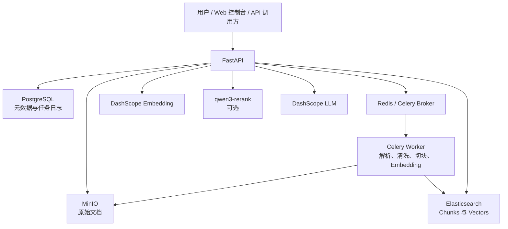

# RAG Builder

RAG Builder 是一个本地可运行的轻量级企业知识库 RAG 工程系统，支持文档上传、异步解析、Embedding、Elasticsearch 混合检索、DashScope LLM 问答、qwen3-rerank 重排、引用溯源、RAG 离线评测和 Web 控制台。

## 项目简介

项目使用 FastAPI 提供 API 和静态控制台，以 PostgreSQL 保存文档元数据与任务日志，以 MinIO 保存原始文件，以 Redis 和 Celery 执行异步解析，并将文本块和向量写入 Elasticsearch。问答链路只基于检索上下文生成答案，同时返回可追溯的 `citations` 与兼容字段 `sources`。

本仓库聚焦可在本地理解、运行、调试和继续扩展的 RAG 后端工程，不包含调用方的岗位推荐、招考分析等业务逻辑。

## 核心能力

- PDF / TXT 文档上传、空文件校验和 SHA-256 内容查重
- MinIO 原始文档对象存储
- PostgreSQL 文档元数据、状态和任务日志
- Redis + Celery 异步解析流水线
- 文本解析、清洗和 Chunk 切分
- DashScope OpenAI 兼容 Embedding
- Elasticsearch 向量检索与关键词混合检索
- DashScope LLM 知识库问答
- 可选的 `qwen3-rerank` 语义重排
- `citations` / `sources` 引用溯源
- 检索、重排、回答、引用和拒答离线评测
- 文档管理、检索调试、评测报告和系统状态 Web 控制台

## 技术栈

| 层次 | 技术 |
|---|---|
| Web API | FastAPI、Uvicorn、Pydantic |
| 元数据 | PostgreSQL、SQLAlchemy |
| 对象存储 | MinIO |
| 异步任务 | Redis、Celery |
| 检索 | Elasticsearch 8.11.1 |
| 模型服务 | DashScope OpenAI 兼容接口、Qwen |
| 重排 | qwen3-rerank |
| 文档处理 | pypdf、PyMuPDF、langchain-text-splitters |
| Web 控制台 | HTML、CSS、JavaScript |
| 本地编排 | Docker Compose |

## 系统架构



文档状态按以下路径流转：

```text
PENDING -> PARSING -> SUCCESS
                    -> FAILED
```

上传接口只完成校验、存储、元数据写入和任务投递，不等待解析、Embedding 与 Elasticsearch 入库完成。

## 目录结构

```text
app/                       FastAPI、服务层、模型、配置与静态控制台
worker/                    Celery 任务、文档流水线、Embedding 与 ES
scripts/                   环境检查和数据库初始化脚本
evals/                     离线评测脚本、用例和最近一次评测结果
docs/
  architecture/            项目全景、架构、流水线和 API
  operations/              启动、测试、排错和验收清单
  evaluation/              RAG 评测说明
  import_reports/          数据导入报告目录说明
docker-compose.yml         PostgreSQL、MinIO、Redis、ES、Kibana
.env.example               可公开的环境变量示例
```

## 本地启动

### 1. 克隆并安装依赖

```powershell
git clone <your-repository-url>
cd rag_builder

python -m venv .venv
.\.venv\Scripts\Activate.ps1
python -m pip install -r requirements.txt
```

### 2. 创建本地配置

```powershell
Copy-Item .env.example .env
```

编辑 `.env`，至少把以下占位符替换为自己的 DashScope API Key：

```env
LLM_API_KEY=your_dashscope_api_key
DASHSCOPE_API_KEY=your_dashscope_api_key
```

`.env` 只用于本机，已被 `.gitignore` 忽略。

### 3. 启动基础依赖

```powershell
docker compose up -d
python scripts/check_env.py
python scripts/init_db.py
```

### 4. 启动 FastAPI

```powershell
uvicorn app.main:app --host 127.0.0.1 --port 18000
```

### 5. 启动 Celery Worker

Windows 下在另一个 PowerShell 窗口运行：

```powershell
python -m celery -A worker.celery_app.celery_app worker --loglevel=info --pool=solo
```

Worker 对浏览已有数据不是必需的，但上传新文档并完成解析时必须启动。

更完整的步骤见 [本地启动指南](docs/operations/local_start.md)。

## 环境变量

| 变量 | 作用 | 示例 |
|---|---|---|
| `DATABASE_URL` | PostgreSQL SQLAlchemy 连接地址 | `postgresql+psycopg2://...` |
| `POSTGRES_PASSWORD` | Compose 初始化 PostgreSQL 的本地密码 | `rag_secure` |
| `MINIO_ENDPOINT` | MinIO API 地址 | `127.0.0.1:19002` |
| `MINIO_ACCESS_KEY` | MinIO 本地访问账号 | `minioadmin` |
| `MINIO_SECRET_KEY` | MinIO 本地访问密码 | `minioadmin` |
| `MINIO_BUCKET_NAME` | 原始文档 Bucket | `rag-docs` |
| `REDIS_URL` | Celery Broker / Backend 地址 | `redis://127.0.0.1:16379/0` |
| `ES_URL` | Elasticsearch 地址 | `http://127.0.0.1:9200` |
| `ES_INDEX_NAME` | 文本块索引名 | `rag_chunks` |
| `ES_VECTOR_DIMS` | Embedding 向量维度 | `1536` |
| `LLM_BASE_URL` | OpenAI 兼容模型服务地址 | DashScope 兼容地址 |
| `LLM_API_KEY` | Embedding / Chat API Key | 仅写入本地 `.env` |
| `EMBEDDING_MODEL_NAME` | Embedding 模型 | `text-embedding-v2` |
| `CHAT_MODEL_NAME` | Chat 模型 | `qwen-plus` |
| `DASHSCOPE_API_KEY` | 可选的独立 rerank Key | 仅写入本地 `.env` |
| `RERANK_ENABLED` | 默认是否启用重排 | `false` |
| `RERANK_MODEL_NAME` | 重排模型 | `qwen3-rerank` |
| `RERANK_APPLY_TO_ASK` | 是否应用到正式问答 | `false` |

完整安全示例见 [.env.example](.env.example)。

## Web 控制台

FastAPI 启动后访问：

```text
http://127.0.0.1:18000
```

控制台包括：

- 全部知识库
- 文档集合
- 上传解析
- 检索调试
- RAG 问答
- 评测报告
- 系统状态
- API 调试

Swagger 地址：

```text
http://127.0.0.1:18000/docs
```

## API 示例

`POST /api/v1/search/ask`

```powershell
$body = @{
    question = "RAG Builder 如何处理上传后的文档？"
} | ConvertTo-Json

Invoke-RestMethod `
    -Method Post `
    -Uri "http://127.0.0.1:18000/api/v1/search/ask" `
    -ContentType "application/json" `
    -Body $body
```

响应会包含：

```json
{
  "answer": "基于知识库上下文生成的回答",
  "answer_type": "grounded",
  "used_retrieval": true,
  "citations": [],
  "sources": []
}
```

完整接口说明见 [API 概览](docs/architecture/api_overview.md)。

## RAG 评测

评测脚本直接复用现有检索与问答服务，不需要启动浏览器或 FastAPI，但需要 Elasticsearch 中已有可评测 Chunk，并且模型配置可用。

```powershell
python evals/run_retrieval_eval.py
python evals/run_answer_eval.py
```

对比 baseline 与 qwen3-rerank：

```powershell
python evals/run_retrieval_eval.py --use-rerank --top-k 3 --top-n 30
```

输出文件：

```text
evals/eval_report.md
evals/eval_results.json
```

仓库中的报告是最近一次离线评测结果。普通问答不会自动更新这些文件，需要重新运行评测脚本。指标为 0 可能表示评测用例与当前知识库数据不匹配、索引为空或依赖不可用，不应直接解释为系统整体故障。

详见 [RAG 评测说明](docs/evaluation/rag_evaluation.md)。

## 注意事项

- 不要提交 `.env`、真实 API Key、生产密码或私有原始数据。
- 本地依赖需要 Docker Desktop 或兼容的 Docker Engine。
- `qwen3-rerank` 是可选能力，远端调用失败时会回退到 baseline 排序。
- Worker 未启动时，新上传文档可能一直停留在 `PENDING`。
- Embedding 输出维度必须与 Elasticsearch Mapping 一致。
- 当前评测数据只用于工程验证，不代表任何真实官方政策或生产结论。
- 删除、重试和跨存储补偿仍有继续增强空间，使用前请阅读项目阶段说明。

## 项目状态

当前为本地工程版 / 开发版，核心的上传、异步解析、检索、问答、引用、重排调试、离线评测和控制台链路已经具备。生产化前仍建议补充自动化测试、权限控制、任务幂等、唯一对象名、失败补偿、文件大小限制和更完整的可观测性。

## 文档

- [项目全景](docs/architecture/project_overview.md)
- [系统架构](docs/architecture/project_architecture.md)
- [RAG 流水线](docs/architecture/rag_pipeline.md)
- [API 概览](docs/architecture/api_overview.md)
- [本地启动](docs/operations/local_start.md)
- [本地测试](docs/operations/testing.md)
- [常见问题](docs/operations/troubleshooting.md)
- [功能验收清单](docs/operations/project_checklist.md)
- [RAG 评测](docs/evaluation/rag_evaluation.md)
- [当前阶段说明](docs/architecture/stage_summary_current.md)
