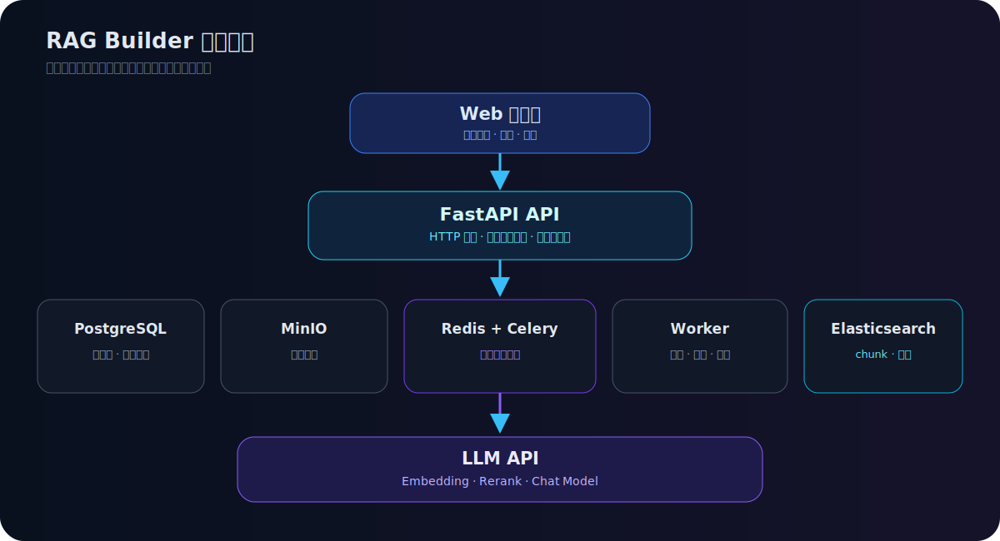
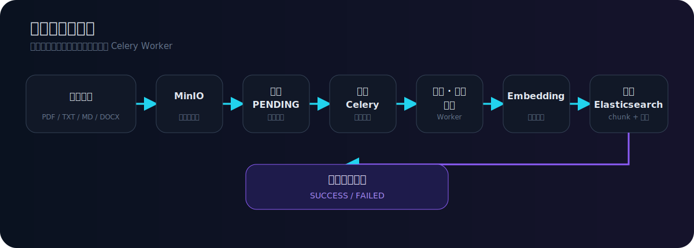
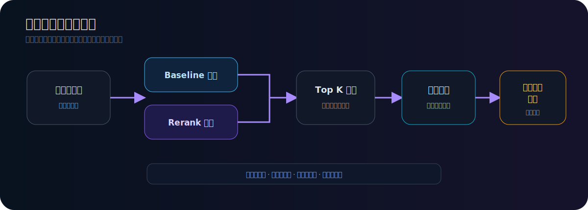
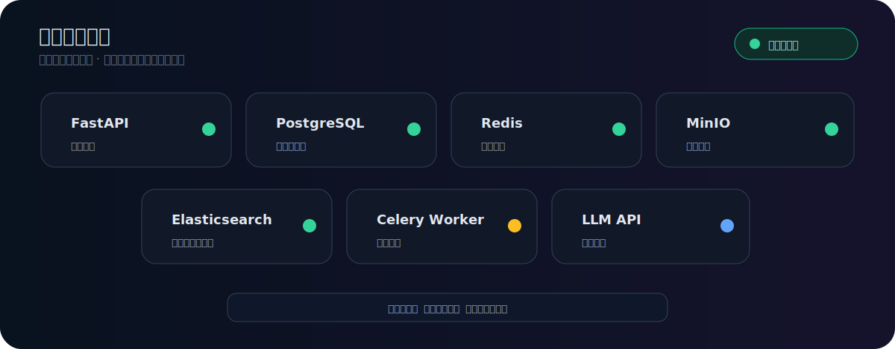
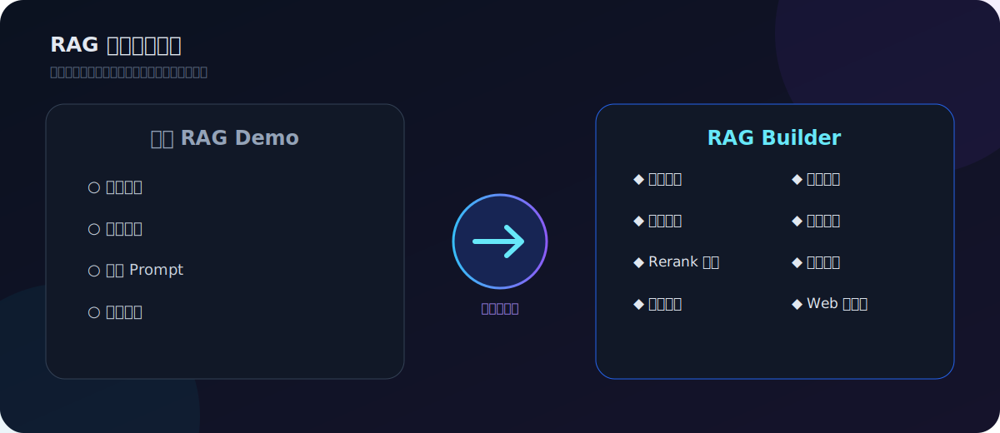
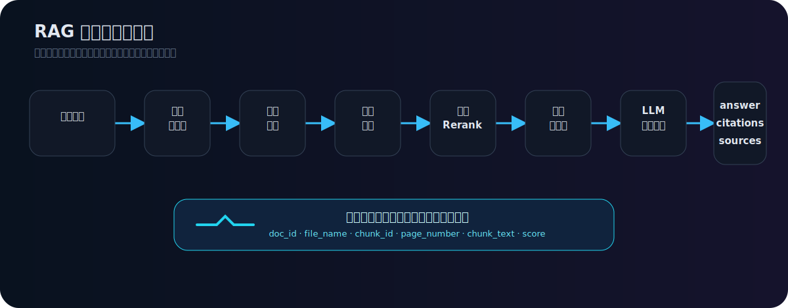

<p align="center">
  
</p>

<h1 align="center">RAG Builder</h1>

<p align="center">
  <strong>本地可运行的轻量级企业知识库 RAG 工程系统</strong>
</p>

<p align="center">
  文档入库 · 异步解析 · 混合检索 · Rerank 重排 · 引用溯源 · 离线评测 · Web 控制台
</p>

<p align="center">
  <code>Python 3.10+</code> · <code>FastAPI</code> · <code>PostgreSQL</code> · <code>MinIO</code> ·
  <code>Redis + Celery</code> · <code>Elasticsearch 8.11.1</code> · <code>Docker Compose</code> · <a href="LICENSE">MIT License</a>
</p>

<p align="center">
  <a href="#-项目简介">项目简介</a> ·
  <a href="#-demo-preview">Demo Preview</a> ·
  <a href="#-系统架构">系统架构</a> ·
  <a href="#-快速开始">快速开始</a> ·
  <a href="#-离线评测">离线评测</a> ·
  <a href="#-roadmap">Roadmap</a>
</p>

---

> RAG Builder 不是“向量检索 + 大模型回答”的最小 Demo，而是把真实知识库系统中需要的文档管理、对象存储、异步任务、状态追踪、检索调试、引用溯源和离线评测串成一条可观察、可调试、可扩展的工程链路。

## 项目简介

RAG Builder 是一个面向企业知识库场景的本地 RAG 工程系统。

它覆盖从文档上传到最终问答的完整链路：

```text
文档上传
  ↓
对象存储
  ↓
异步解析
  ↓
文本清洗与切分
  ↓
Embedding 向量化
  ↓
Elasticsearch 混合检索
  ↓
可选 Rerank 重排
  ↓
LLM 生成带引用回答
  ↓
检索调试与离线评测
```

当前系统支持单文件和批量上传 PDF / TXT / Markdown / Word(.docx) 文档。原文件保存到 MinIO，文档状态和任务日志保存到 PostgreSQL，解析、切分和 Embedding 由 Redis + Celery 异步执行，chunk 与向量写入 Elasticsearch。问答阶段使用 Elasticsearch 混合检索，可选接入 `qwen3-rerank` 重排，再通过 OpenAI-compatible API 调用 LLM 生成带引用来源的回答。

本项目适合展示一个 RAG 系统从“能回答”走向“可管理、可追踪、可评测、可扩展”的工程化过程。

---

## 项目状态

当前仓库为 **本地运行版 / 工程展示版**：

* 支持 Docker Compose 启动 PostgreSQL、MinIO、Redis、Elasticsearch 等依赖。
* 支持本地文档上传、异步解析、检索问答和评测调试。
* 不包含真实企业文档、API Key、数据库文件或私有知识库数据。
* 适合在本地开发环境运行，建议至少 8GB 内存。
* 暂未提供线上演示环境，公开部署前需要补充鉴权、租户隔离、对象存储权限、日志脱敏和资源限流。

---

## Demo Preview

### 企业知识库工作台

<p align="center">
  
</p>

### RAG 链路与文档状态

<p align="center">
  
</p>

### 检索调试与 Rerank 重排

<p align="center">
  
</p>

### 系统状态面板

<p align="center">
  
</p>

---

## 为什么不是普通 RAG Demo

很多 RAG Demo 能快速跑通一次问答，但通常只覆盖最亮眼的一小段链路：

```text
文档切块 → 向量化 → Top K 检索 → 拼 Prompt → 调模型
```

这种 Demo 适合解释概念，但很难回答真实系统中的工程问题：

* 文档导入失败怎么办？
* 原文件存在哪里？
* 上传后为什么不能立刻入库？
* 解析任务状态在哪里看？
* 文档是 `PENDING`、`PARSING`、`SUCCESS` 还是 `FAILED`？
* 检索结果为什么命中这个 chunk？
* Rerank 是否真的改善排序？
* 回答依据来自哪篇文档、哪一页、哪一段？
* 知识库没有依据时是否应该拒答？
* 系统依赖是否健康？
* 如何用固定问题集持续评测检索和回答质量？

RAG Builder 的工程价值在于：把这些 “Demo 之外的问题” 变成系统的一等公民，让 RAG 不只是一次模型调用，而是一条可开发、可调试、可观察、可迭代的后端链路。

<p align="center">
  
</p>

---

## 核心能力

### 文档管理与对象存储

* 支持 PDF / TXT / Markdown / Word(.docx) 文档上传。
* 支持批量文档上传。
* 原文件保存到 MinIO。
* PostgreSQL 保存文档元数据、处理状态和任务日志。
* 支持文档列表、状态查询、删除和重试。

### 异步入库流水线

* 上传接口只做必要同步操作。
* 耗时任务由 Redis + Celery Worker 后台处理。
* 文档状态可追踪：`PENDING -> PARSING -> SUCCESS / FAILED`。
* 解析、清洗、切分、Embedding 和索引写入解耦。
* 失败原因可记录，便于后续重试和排查。

### 混合检索与 Rerank

* Elasticsearch 存储文本 chunk、向量和检索元数据。
* 支持向量检索和关键词检索组合。
* 支持文件类型、最高分文档、相关性阈值过滤。
* 可选接入 `qwen3-rerank` 进行二阶段重排。
* 检索调试页可对比 baseline 与 rerank 差异。

### 引用溯源与拒答边界

* 回答返回 `answer`、`citations` 和 `sources`。
* 引用来源包含文档 ID、文件名、chunk ID、页码、原文片段和分数。
* 引用字段来自后端检索结果，不由模型虚构。
* 知识库依据不足时，系统倾向返回“没有足够依据”，避免无来源强答。

### 离线评测

* 支持固定问题集进行检索评测。
* 支持回答质量评测。
* 支持 baseline 与 rerank 对比。
* 适合持续观察召回、排序、引用覆盖、弱依据回答和拒答行为。

### Web 控制台

内置原生 HTML / CSS / JavaScript 控制台，无需额外前端工程即可观察系统：

* 知识库概览
* 文档管理
* 批量上传
* RAG 问答
* 检索调试
* 评测报告
* 系统状态
* API 调试入口

---

## 功能总览

| 模块     | 能力                                         |
| ------ | ------------------------------------------ |
| 文档上传   | 单文件 / 批量上传，支持 PDF、TXT、Markdown、Word(.docx) |
| 对象存储   | 使用 MinIO 保存原始文件                            |
| 元数据管理  | PostgreSQL 保存文档状态、任务日志和处理结果                |
| 异步处理   | Redis + Celery 处理解析、切分、Embedding、入库        |
| 向量索引   | Elasticsearch 保存 chunk、向量和检索元数据            |
| 混合检索   | 向量检索 + 关键词检索 + 过滤策略                        |
| Rerank | 可选 `qwen3-rerank` 二阶段重排                    |
| 问答生成   | LLM 基于检索上下文生成带引用回答                         |
| 引用溯源   | 返回文档、页码、chunk、score 和原文片段                  |
| 检索调试   | 查看 baseline、rerank、Top K、Top N、阈值影响        |
| 离线评测   | 固定问题集评测检索和回答质量                             |
| 系统状态   | 查看依赖服务、模型配置和 Worker 状态                     |

---

## 系统架构

上传接口只做必要同步操作：校验文件、计算哈希、写入原文件、创建 `PENDING` 文档记录并投递 Celery 任务。解析、切块、Embedding 和 Elasticsearch 入库由 Worker 在后台完成。

<p align="center">
  
</p>

核心边界：

| 组件                  | 职责                             |
| ------------------- | ------------------------------ |
| FastAPI             | HTTP 接口、同步业务编排、Web 控制台         |
| PostgreSQL          | 文档元数据、任务状态、运行记录                |
| MinIO               | 原始文档对象存储                       |
| Redis               | Celery Broker / Result Backend |
| Celery Worker       | 文档解析、清洗、切分、Embedding、索引写入      |
| Elasticsearch       | chunk、向量、关键词字段和检索元数据           |
| LLM / Embedding API | 向量化、Rerank、最终回答生成              |

---

## 文档入库流水线

文档入库不是简单地把文本塞进向量库。RAG Builder 把入库拆成可追踪的工程步骤：上传阶段创建任务小票，后台任务再完成解析和索引写入。

<p align="center">
  
</p>

文档状态流转：

```text
PENDING -> PARSING -> SUCCESS
                    -> FAILED
```

先写入 PostgreSQL 的 `PENDING` 记录非常关键。它让上传接口可以立即返回 `doc_id`，也让 Worker、状态查询、失败记录和未来重试都围绕同一个文档主键工作。

---

## RAG 问答与引用溯源

问答阶段目标不是让模型“看起来会答”，而是让回答能回到知识库证据上。

```text
用户问题
  ↓
问题向量化
  ↓
Elasticsearch 向量 + 关键词混合检索
  ↓
文件类型、最高分文档和相关性阈值过滤
  ↓
可选 qwen3-rerank 重排
  ↓
组织检索上下文
  ↓
调用 Chat 模型
  ↓
返回 answer、citations、sources
```

每条来源可以包含：

| 字段            | 含义             |
| ------------- | -------------- |
| `doc_id`      | 来源文档 ID        |
| `file_name`   | 来源文件名          |
| `chunk_id`    | 命中的文本块 ID      |
| `page_number` | PDF 页码，TXT 可为空 |
| `chunk_text`  | 支撑回答的原文片段      |
| `score`       | 检索或重排分数        |

引用字段来自后端检索结果，不由模型虚构。检索依据不足时，系统倾向返回“知识库中没有足够依据”，并避免把无来源内容包装成确定答案。

<p align="center">
  
</p>

---

## 检索调试

RAG 系统的质量问题通常不只发生在最终回答里，也可能发生在切块、召回、排序、过滤、引用选择和拒答策略中。

检索调试可以帮助开发者查看：

* baseline 混合检索返回了哪些 chunk。
* 每个 chunk 的文档、页码、分数和文本片段。
* `qwen3-rerank` 是否改变排序。
* Top K、Top N、阈值和重排策略对结果的影响。
* Rerank 调用失败时是否回退到 baseline。

---

## 离线评测

离线评测用于固定问题集上的持续对比。评测关注的不是单次回答是否漂亮，而是召回、排序、引用覆盖、弱依据回答、拒答行为和失败用例能否被持续记录。

### 默认评测集

```powershell
python evals/run_retrieval_eval.py
python evals/run_answer_eval.py
```

### 公务员 / 事业单位政策评测集

```powershell
python evals/run_retrieval_eval.py --case-file evals/cases/exam_policy_cases.json
python evals/run_answer_eval.py --case-file evals/cases/exam_policy_cases.json
```

### 对比 baseline 与 rerank

```powershell
python evals/run_retrieval_eval.py --use-rerank --top-k 3 --top-n 30
```

---

## Web 控制台

本地访问地址：

```text
http://127.0.0.1:18000
```

当前控制台覆盖：

| 页面     | 说明                                                             |
| ------ | -------------------------------------------------------------- |
| 知识库概览  | 查看文档、评测和运行状态摘要                                                 |
| 文档管理   | 查看文档列表、状态、任务日志、重试和删除                                           |
| 上传解析   | 拖拽或选择多个文档，并观察异步处理状态                                            |
| RAG 问答 | 提问并查看引用证据                                                      |
| 检索调试   | 对比 baseline 和 rerank 结果                                        |
| 评测报告   | 读取最近一次离线评测产物                                                   |
| 系统状态   | 查看 FastAPI、PostgreSQL、Redis、MinIO、Elasticsearch、Worker 和模型配置状态 |
| API 调试 | 打开 FastAPI Swagger                                             |

---

## 快速开始

### 环境要求

* Python 3.10+
* Docker Desktop
* Windows PowerShell
* 可用的 DashScope API Key 或 OpenAI-compatible 模型服务 Key
* 建议至少 8GB 内存环境运行

### 1. 克隆项目

```powershell
git clone https://github.com/hf007019-lgtm/rag-builder.git
cd rag-builder
```

### 2. 创建虚拟环境并安装依赖

```powershell
python -m venv .venv
.\.venv\Scripts\activate
python -m pip install -r requirements.txt
```

### 3. 准备配置

```powershell
Copy-Item .env.example .env
```

编辑 `.env`，填写你自己的模型服务地址和 API Key。

> 不要把真实 API Key、密码或生产连接信息写入 README、日志或 Git。

### 4. 启动基础依赖

```powershell
docker compose up -d
python scripts/check_env.py
python scripts/init_db.py
```

### 5. 启动 FastAPI

```powershell
uvicorn app.main:app --reload --host 127.0.0.1 --port 18000
```

### 6. 启动 Celery Worker

在另一个已激活虚拟环境的 PowerShell 窗口运行：

```powershell
python -m celery -A worker.celery_app:celery_app worker --loglevel=info --pool=solo
```

访问：

```text
Web 控制台：http://127.0.0.1:18000
Swagger：http://127.0.0.1:18000/docs
```

更多说明：

* [本地启动指南](docs/operations/local_start.md)
* [本地测试清单](docs/operations/testing.md)
* [排错指南](docs/operations/troubleshooting.md)

---

## 关键配置

公开仓库只应提交 `.env.example`，真实 `.env` 应保留在本地。

| 配置                                      | 作用                                  |
| --------------------------------------- | ----------------------------------- |
| `DATABASE_URL`                          | PostgreSQL SQLAlchemy 连接            |
| `MINIO_ENDPOINT`                        | MinIO API 地址                        |
| `MINIO_ACCESS_KEY` / `MINIO_SECRET_KEY` | MinIO 本地访问凭据                        |
| `MINIO_BUCKET_NAME`                     | 原始文件 Bucket                         |
| `REDIS_URL`                             | Celery Broker / Result Backend 地址   |
| `ES_URL`                                | Elasticsearch 地址                    |
| `ES_INDEX_NAME`                         | Elasticsearch chunk 索引名             |
| `ES_VECTOR_DIMS`                        | Embedding 向量维度                      |
| `LLM_BASE_URL`                          | OpenAI 兼容模型服务地址                     |
| `LLM_API_KEY`                           | Embedding / Chat API Key            |
| `EMBEDDING_MODEL_NAME`                  | Embedding 模型名                       |
| `EMBEDDING_BATCH_SIZE`                  | Embedding 分批大小，默认 20，避免单次请求超过模型批量限制 |
| `CHAT_MODEL_NAME`                       | Chat 模型名                            |
| `DASHSCOPE_API_KEY`                     | 可选独立 Rerank API Key                 |
| `RERANK_ENABLED`                        | 是否启用 Rerank                         |
| `RERANK_MODEL_NAME`                     | Rerank 模型名                          |
| `RERANK_APPLY_TO_ASK`                   | 是否将 Rerank 应用到正式问答链路                |

---

## API 概览

| 接口                                    | 说明            |
| ------------------------------------- | ------------- |
| `POST /api/v1/documents/upload`       | 上传文档并创建异步解析任务 |
| `POST /api/v1/documents/batch-upload` | 批量上传文档        |
| `GET /api/v1/documents`               | 查看文档列表        |
| `GET /api/v1/documents/{doc_id}`      | 查看文档详情        |
| `POST /api/v1/search/ask`             | RAG 问答        |
| `POST /api/v1/search/debug`           | 检索调试          |
| `GET /api/v1/health`                  | 健康检查          |
| `GET /api/v1/system/status`           | 系统状态          |

具体以 Swagger 文档为准：

```text
http://127.0.0.1:18000/docs
```

---

## 项目目录

```text
rag-builder/
├── app/
│   ├── api/              # FastAPI 路由
│   ├── core/             # 配置与核心设置
│   ├── db/               # PostgreSQL、MinIO、Redis、ES 客户端
│   ├── models/           # 数据模型
│   ├── schemas/          # 请求与响应结构
│   ├── services/         # 文档、检索、问答、评测等服务
│   └── static/           # Web 控制台
├── worker/               # Celery Worker 与异步任务
├── docs/                 # 架构、运行、评测和排错文档
├── evals/                # 检索和回答评测脚本
├── scripts/              # 初始化、检查和迁移脚本
├── docker-compose.yml    # 本地依赖编排
├── .env.example          # 环境变量示例
├── README.md
└── requirements.txt
```

---

## 数据安全

本仓库不应包含：

* 真实 `.env`
* 真实 API Key
* 生产数据库连接
* 企业私有文档
* 用户上传文件
* 本地数据库 dump
* MinIO 数据目录
* Elasticsearch 数据目录

本地运行产生的数据应由 `.gitignore` 排除。公开仓库只提供代码、文档、示例配置和脱敏截图。

---

## Roadmap

### 已完成

* [x] FastAPI 后端服务
* [x] Docker Compose 本地依赖编排
* [x] PostgreSQL 文档元数据管理
* [x] MinIO 原始文件存储
* [x] Redis + Celery 异步处理
* [x] PDF / TXT / Markdown / Word(.docx) 文档解析
* [x] 文本清洗与 chunk 切分
* [x] DashScope Embedding
* [x] Elasticsearch 混合检索
* [x] 可选 `qwen3-rerank` 重排
* [x] RAG 问答与引用溯源
* [x] 检索调试
* [x] 离线评测
* [x] Web 控制台
* [x] 系统状态面板

---

## 相关文档

* [项目全景](docs/architecture/project_overview.md)
* [系统架构](docs/architecture/project_architecture.md)
* [RAG 流水线](docs/architecture/rag_pipeline.md)
* [API 概览](docs/architecture/api_overview.md)
* [当前阶段总结](docs/architecture/stage_summary_current.md)
* [RAG 评测说明](docs/evaluation/rag_evaluation.md)
* [本地启动指南](docs/operations/local_start.md)
* [本地测试清单](docs/operations/testing.md)
* [排错指南](docs/operations/troubleshooting.md)

---

## 适用场景

适合：

* 企业知识库问答系统原型
* RAG 后端工程学习
* 文档检索与引用溯源实践
* RAG 检索调试和评测实验
* FastAPI + Celery + Elasticsearch 工程练习
* 面向业务系统的知识库 API 服务

不适合：

* 直接作为生产级多租户知识库系统
* 存储未经授权的企业私有文档
* 在无鉴权情况下公开部署
* 将无来源生成内容当作确定事实

---

## 开源协议

本项目使用 [MIT License](LICENSE)。

---

## 免责声明

本项目用于 RAG 工程学习、知识库系统原型和本地实验。模型生成内容可能存在错误，引用结果也可能受文档质量、切块策略、检索参数和重排模型影响。请在实际业务中结合人工审核、权限控制和合规要求使用。
