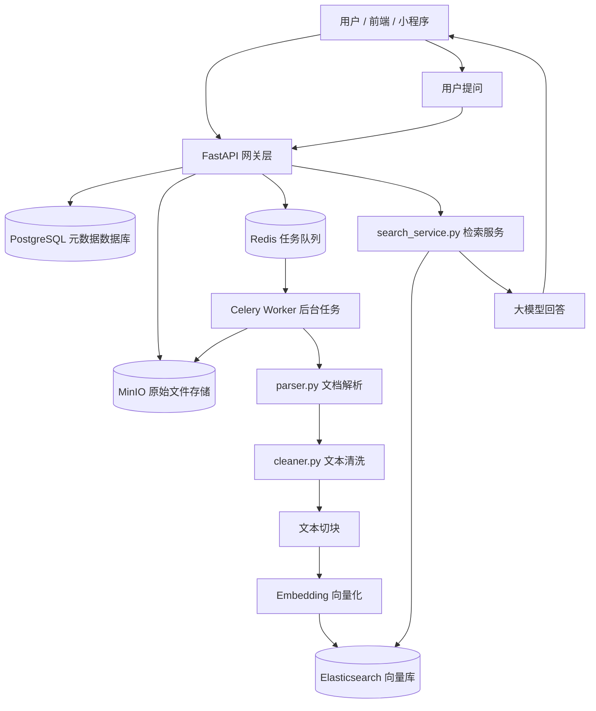
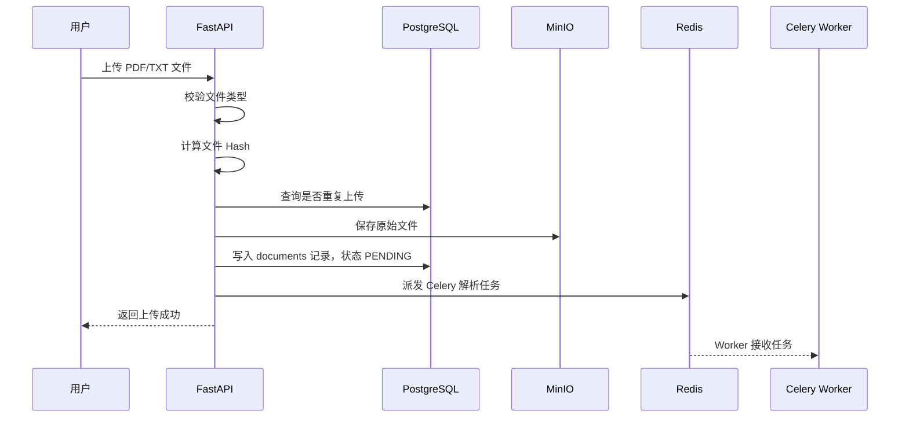
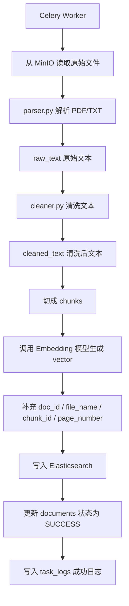
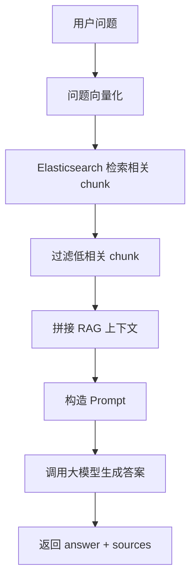

# RAG Builder 系统架构说明

## 1. 项目定位

RAG Builder 是一个轻量级企业知识库 RAG 系统。

项目目标不是复刻完整的 RAGFlow，而是参考 RAGFlow 工程思想的轻量实现，聚焦核心 RAG 链路实现，适合本地部署、功能演示和二次扩展。

系统支持：

- PDF / TXT 文档上传
- 原始文件存储
- 文档异步解析
- 文本清洗
- Chunk 切分
- Embedding 向量化
- Elasticsearch 向量检索
- RAG 智能问答
- 来源追踪
- 任务日志
- 失败任务重试
- 系统依赖健康检查

---

## 2. 整体架构图



---

## 3. 核心模块说明

### 3.1 FastAPI 网关层

对应目录：

```text
app/
```

主要作用：

- 接收前端请求
- 提供 REST API 接口
- 调用业务服务层
- 返回统一响应结果

代表文件：

```text
app/main.py
app/api/v1/document.py
app/api/v1/search.py
app/api/v1/health.py
```

其中：

| 文件 | 作用 |
|---|---|
| main.py | FastAPI 项目入口，注册路由 |
| document.py | 文档上传、列表、状态、删除、任务日志、重试接口 |
| search.py | RAG 问答接口 |
| health.py | 健康检查接口 |

---

### 3.2 PostgreSQL 元数据层

对应文件：

```text
app/db/session.py
app/models/document.py
app/models/task_log.py
```

PostgreSQL 不保存原始文件，也不保存向量。

它主要保存：

- 文档 ID
- 文件名
- 文件哈希
- 文档状态
- 创建时间
- 任务日志
- chunk 数量
- 失败原因

核心表：

```text
documents
task_logs
```

#### documents 表

用于记录文档基本信息。

| 字段 | 含义 |
|---|---|
| id | 文档 ID |
| file_name | 文件名 |
| file_hash | 文件哈希，用于去重 |
| status | 文档状态 |
| created_at | 创建时间 |

状态说明：

| 状态 | 含义 |
|---|---|
| PENDING | 等待解析 |
| PARSING | 正在解析 |
| SUCCESS | 解析成功 |
| FAILED | 解析失败 |

#### task_logs 表

用于记录 Celery Worker 的任务执行过程。

| 字段 | 含义 |
|---|---|
| id | 日志 ID |
| doc_id | 文档 ID |
| task_name | 任务名称 |
| status | 任务状态 |
| message | 任务说明 |
| chunk_count | 生成的 chunk 数量 |
| error_message | 失败原因 |
| created_at | 创建时间 |
| updated_at | 更新时间 |

---

### 3.3 MinIO 原始文件存储层

对应文件：

```text
app/db/minio_client.py
```

MinIO 负责保存用户上传的原始文件。

例如：

```text
PDF 文件
TXT 文件
```

为什么不用 PostgreSQL 保存原始文件？

因为：

1. 文件体积可能比较大
2. 数据库存文件会影响查询性能
3. 对象存储更适合保存 PDF、TXT、图片等文件
4. 后期迁移到云存储更方便

本项目中：

```text
PostgreSQL 保存文件信息
MinIO 保存文件本体
```

---

### 3.4 Redis + Celery 异步任务层

对应文件：

```text
worker/celery_app.py
worker/tasks.py
```

Redis 作用：

```text
任务队列
```

Celery Worker 作用：

```text
后台执行耗时任务
```

为什么文档解析要异步？

因为文档解析、切块、向量化、写入 ES 可能比较慢。

如果同步执行，用户上传文件时可能需要等待很久。

异步后流程变成：

```text
用户上传文件
↓
FastAPI 立即返回“上传成功，解析中”
↓
Celery Worker 后台慢慢处理文档
```

这样用户体验更好，也更符合真实企业项目设计。

---

## 4. 文档上传与入库流程

### 4.1 上传链路



### 4.2 入库链路



---

## 5. 文档处理流水线

对应目录：

```text
worker/pipeline/
```

核心文件：

| 文件 | 中文含义 | 作用 |
|---|---|---|
| parser.py | 文档解析器 | 把 PDF/TXT 二进制文件解析成文本 |
| cleaner.py | 文本清洗器 | 去掉多余空格、空行、不可见字符 |
| ingestion_pipeline.py | 文档入库流水线 | 串联解析、清洗、切块、向量化、入库 |
| metadata_extractor.py | 元数据提取器 | 生成 chunk_id、提取 page_number |

处理顺序：

```text
file_bytes
↓
raw_text
↓
cleaned_text
↓
chunks
↓
vectors
↓
Elasticsearch
```

变量含义：

| 变量 | 含义 |
|---|---|
| file_bytes | 文件二进制内容 |
| raw_text | 解析出来的原始文本 |
| cleaned_text | 清洗后的文本 |
| chunk_text | 文本切片内容 |
| vector | 文本切片对应的向量 |
| processed_data | chunk_text + vector 的列表 |

---

## 6. Elasticsearch 向量检索层

对应文件：

```text
worker/deepdoc/es_client.py
```

Elasticsearch 负责保存：

- chunk_text
- vector
- doc_id
- file_name
- chunk_id
- page_number

索引名称：

```text
rag_chunks
```

一条 chunk 数据大概长这样：

```json
{
  "doc_id": 15,
  "file_name": "task_log_test_01.txt",
  "chunk_id": "doc_15_chunk_0",
  "page_number": null,
  "chunk_text": "任务日志测试文档 01...",
  "vector": [0.012, -0.034, 0.156]
}
```

其中：

| 字段 | 作用 |
|---|---|
| doc_id | 关联 PostgreSQL 中的文档 |
| file_name | 标记来源文件 |
| chunk_id | 标记文本切片编号 |
| page_number | PDF 页码，TXT 通常为空 |
| chunk_text | 检索后提供给大模型的上下文 |
| vector | 用于语义相似度检索 |

---

## 7. RAG 问答流程

对应文件：

```text
app/services/search_service.py
```

问答流程：



详细步骤：

1. 用户输入问题
2. 系统把问题转成 query vector
3. Elasticsearch 检索相似 chunk
4. 过滤低相关结果
5. 拼接上下文 context
6. 调用大模型生成回答
7. 返回答案和 sources 来源

返回结果包括：

```json
{
  "answer": "这是大模型基于知识库生成的回答。",
  "sources": [
    {
      "doc_id": 15,
      "file_name": "task_log_test_01.txt",
      "chunk_id": "doc_15_chunk_0",
      "page_number": null,
      "chunk_text": "任务日志测试文档 01...",
      "score": 4.12
    }
  ]
}
```

---

## 8. 来源追踪设计

本项目支持 sources 来源追踪。

来源信息包括：

| 字段 | 含义 |
|---|---|
| doc_id | 文档 ID |
| file_name | 文件名 |
| chunk_id | 文本块 ID |
| page_number | PDF 页码 |
| chunk_text | 原文片段 |
| score | 检索相关性分数 |

为什么要做来源追踪？

因为 RAG 系统不能只返回答案，还要告诉用户：

```text
答案是根据哪些资料生成的
来自哪个文件
来自哪一页
原文片段是什么
```

这可以提高系统可信度，也方便排查大模型回答是否准确。

---

## 9. 任务日志与失败重试设计

### 9.1 任务日志

对应接口：

```text
GET /api/v1/documents/{doc_id}/task-log
```

任务日志记录：

- 任务是否开始
- 任务是否成功
- 任务是否失败
- 失败原因
- chunk 数量

这样可以解决一个问题：

```text
用户只知道文档 FAILED，但不知道为什么失败。
```

有了 task_logs 后，可以看到具体失败原因，例如：

```text
API Key 错误
PDF 解析失败
MinIO 文件不存在
Elasticsearch 写入失败
```

### 9.2 失败重试

对应接口：

```text
POST /api/v1/documents/{doc_id}/retry
```

设计规则：

| 文档状态 | 是否允许重试 | 原因 |
|---|---|---|
| FAILED | 允许 | 失败后可以重新解析 |
| SUCCESS | 不允许 | 避免重复写入 ES |
| PENDING | 不允许 | 已经在等待队列中 |
| PARSING | 不允许 | Worker 正在处理 |

失败重试流程：

```text
FAILED
↓
改回 PENDING
↓
重新发送 Celery 任务
↓
Worker 重新解析
↓
写入新的 task_log
```

---

## 10. 健康检查设计

对应接口：

```text
GET /api/v1/health
GET /api/v1/health/dependencies
```

基础健康检查：

```text
检查 FastAPI 服务是否正常运行
```

依赖健康检查：

```text
检查 PostgreSQL、MinIO、Redis、Elasticsearch 是否正常
```

为什么要做健康检查？

因为 RAG 系统依赖多个组件：

```text
PostgreSQL
MinIO
Redis
Celery
Elasticsearch
大模型 API
```

一旦某个服务没启动，系统就可能无法正常工作。

健康检查接口可以帮助快速定位问题。

---

## 11. 技术栈说明

| 技术 | 作用 |
|---|---|
| FastAPI | 提供后端 API 接口 |
| PostgreSQL | 保存文档元数据和任务日志 |
| MinIO | 保存原始 PDF/TXT 文件 |
| Redis | Celery 消息队列 |
| Celery | 异步执行文档解析任务 |
| Elasticsearch | 保存 chunk 和 vector，提供检索能力 |
| DashScope / Qwen | 提供 Embedding 和 Chat 能力 |
| SQLAlchemy | 操作 PostgreSQL |
| Pydantic | 定义接口请求和响应结构 |
| Docker Compose | 启动本地依赖服务 |

---

## 12. 为什么这样设计？

### 12.1 为什么用 PostgreSQL？

因为文档状态、文件名、任务日志这些是结构化数据，适合用关系型数据库保存。

### 12.2 为什么用 MinIO？

因为 PDF/TXT 是原始文件，适合放对象存储，而不是直接塞进数据库。

### 12.3 为什么用 Redis + Celery？

因为文档解析和向量化是耗时任务，异步处理可以避免用户上传时长时间等待。

### 12.4 为什么用 Elasticsearch？

因为 Elasticsearch 既可以保存文本 chunk，也可以支持向量检索，适合做 RAG 的检索层。

### 12.5 为什么要做 task_logs？

因为真实系统不能只显示 SUCCESS / FAILED，还要能追踪失败原因和执行过程。

### 12.6 为什么要做 retry？

因为外部依赖可能临时失败，比如 API Key、网络、ES 等问题。失败重试可以提高系统可用性。

### 12.7 为什么要返回 sources？

因为 RAG 系统需要可解释性，用户需要知道答案来自哪些原文内容。

---

## 13. 当前项目边界

本项目是轻量级企业知识库 RAG 系统，不追求完整复刻 RAGFlow。

当前不做：

- 用户系统
- 多租户权限
- 完整前端后台
- OCR 深度解析
- 知识图谱
- 复杂 Agent 工作流
- 企业级权限管理

当前重点是：

```text
把 RAG 的核心工程链路做完整、跑通，便于本地验证和持续扩展。
```

---

## 14. 项目公开描述

项目名称：

```text
企业级知识库 RAG 问答系统
```

项目描述：

```text
基于 FastAPI、PostgreSQL、MinIO、Redis、Celery、Elasticsearch 和大模型 API 构建轻量级企业知识库 RAG 问答系统，支持 PDF/TXT 文档上传、异步解析、文本清洗、Chunk 切分、Embedding 向量化、向量检索、来源追踪、任务日志、失败重试和依赖健康检查。
```

项目亮点：

- 设计文档上传、异步解析、向量入库、知识库问答完整链路
- 使用 Redis + Celery 实现耗时任务异步化
- 使用 MinIO 保存原始文件，PostgreSQL 保存元数据
- 使用 Elasticsearch 存储 chunk 和 vector，实现语义检索
- 支持 sources 来源追踪，提高回答可信度
- 支持 task_logs 和 retry，提高系统可维护性
- 提供 health dependencies 接口，方便部署排查

---

## 15. 总结

RAG Builder 的核心架构可以总结为：

```text
FastAPI 负责接收请求
PostgreSQL 负责保存元数据
MinIO 负责保存原始文件
Redis 负责任务队列
Celery Worker 负责后台解析
Elasticsearch 负责向量检索
大模型负责向量化和生成回答
```

本项目参考 RAGFlow 的工程化思想，但保持轻量级企业知识库 RAG 系统的可控规模，重点体现 RAG 系统的核心链路和后端工程能力。
