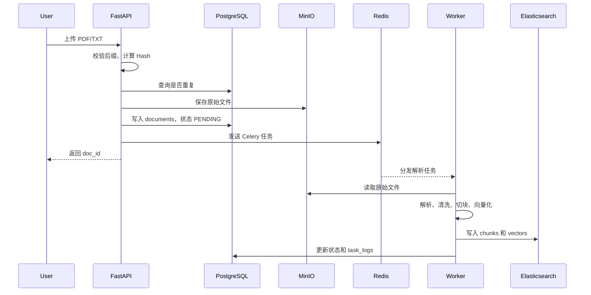
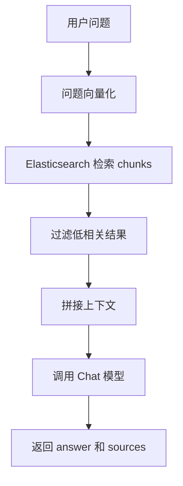

# 架构说明

RAG Builder 的结构比较直接：FastAPI 负责接口，Worker 负责耗时解析任务，PostgreSQL / MinIO / Elasticsearch 分别保存元数据、原始文件和检索数据。

## 模块划分

```text
app/
  api/v1/      路由入口
  services/    业务逻辑
  schemas/     请求和响应结构
  models/      PostgreSQL 表模型
  db/          数据库和 MinIO 连接
  core/        配置、常量、本地代理处理

worker/
  celery_app.py
  tasks.py
  pipeline/
  deepdoc/
```

## 组件职责

| 组件 | 职责 |
|---|---|
| FastAPI | 提供上传、查询、删除、问答和健康检查接口 |
| PostgreSQL | 保存 `documents` 和 `task_logs` |
| MinIO | 保存用户上传的 PDF / TXT 原始文件 |
| Redis | Celery 的消息队列 |
| Celery Worker | 后台执行文档解析和入库任务 |
| Elasticsearch | 保存文本块、向量和来源字段 |
| DashScope / Qwen | 生成 Embedding，调用 Chat 模型回答问题 |

## 数据存储

PostgreSQL 只保存结构化信息：

- 文档 ID
- 文件名
- 文件 Hash
- 文档状态
- 创建时间
- 任务日志
- chunk 数量
- 失败原因

MinIO 保存原始文件。这样文档本体不会塞进数据库，也方便后续替换成其他对象存储。

Elasticsearch 保存检索需要的数据：

```json
{
  "doc_id": 15,
  "file_name": "rag_test_01.txt",
  "chunk_id": "doc_15_chunk_0",
  "page_number": null,
  "chunk_text": "RAG 的全称是 Retrieval-Augmented Generation...",
  "vector": [0.012, -0.034, 0.156]
}
```

## 文档上传链路



文档状态流转：

```text
PENDING -> PARSING -> SUCCESS
                    -> FAILED
```

## Worker 处理流程

Worker 收到 `parse_document_task` 后，会按下面顺序处理：

```text
读取 documents 记录
-> 从 MinIO 读取文件
-> parser.py 解析 PDF/TXT
-> cleaner.py 清洗文本
-> core_engine.py 切块并生成 Embedding
-> metadata_extractor.py 补充 chunk_id 和 page_number
-> es_client.py 写入 Elasticsearch
-> 更新 documents.status
-> 写入 task_logs
```

如果中间失败，文档状态会变成 `FAILED`，错误信息写入 `task_logs.error_message`。

## 问答链路



`sources` 用来保留回答依据：

| 字段 | 说明 |
|---|---|
| `doc_id` | 文档 ID |
| `file_name` | 来源文件 |
| `chunk_id` | 文本块 ID |
| `page_number` | PDF 页码，TXT 通常为空 |
| `chunk_text` | 原文片段 |
| `score` | 检索得分 |

## 健康检查

接口：

```text
GET /api/v1/health
GET /api/v1/health/dependencies
```

`/dependencies` 会检查 PostgreSQL、MinIO、Redis 和 Elasticsearch。大模型 API 不在当前健康检查范围内，通常在解析或问答时暴露配置问题。

## 当前边界

当前实现只覆盖轻量级 RAG 后端的主流程。下面这些能力暂时没有做：

- 用户登录和权限
- 多租户
- 管理后台 UI
- OCR
- 知识图谱
- Agent 工作流
- Rerank
