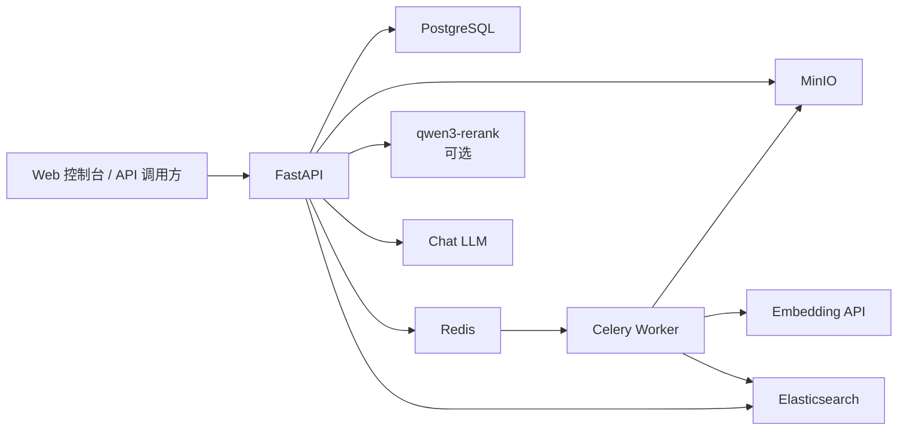

# RAG Builder 系统架构

## 文档说明

- 中文名：系统架构说明
- 文件作用：说明组件边界、数据存储职责和主要调用关系。
- 为什么需要：帮助新开发者在修改代码前理解同步 API、异步 Worker 和各存储组件的分工。
- 英文文件名：`project_architecture.md`，意为“项目架构”。

## 总体结构



## 组件职责

| 组件 | 职责 |
|---|---|
| FastAPI | 接收上传、查询、删除、检索、问答和控制台请求 |
| PostgreSQL | 保存 `documents`、`task_logs` 和可查询状态 |
| MinIO | 保存 PDF / TXT 原始文件 |
| Redis | Celery Broker 与 Result Backend |
| Celery Worker | 执行解析、清洗、切块、Embedding 和入库 |
| Elasticsearch | 保存 Chunk、向量和来源元数据，执行混合检索 |
| DashScope | 提供 OpenAI 兼容 Embedding、Chat 和可选 Rerank |
| Web 控制台 | 提供本地文档管理、问答、调试、评测和状态入口 |

## 代码边界

```text
app/
  api/v1/       HTTP 路由和参数边界
  services/     同步业务编排、检索、问答和控制台服务
  schemas/      Pydantic 请求与响应模型
  models/       SQLAlchemy 数据模型
  db/           PostgreSQL 与 MinIO 客户端
  core/         配置、状态常量和本地代理处理
  static/       原生 Web 控制台

worker/
  tasks.py      Celery 任务、状态更新和任务日志
  pipeline/     解析、清洗、元数据补充和入库流水线
  deepdoc/      文本切分、Embedding 与 Elasticsearch 客户端
```

路由层不承载耗时解析。上传接口在创建 `PENDING` 文档记录并投递 Celery 任务后立即返回，完整解析由 Worker 执行。

## 数据职责

PostgreSQL 保存结构化元数据和任务状态，不保存原始文件或向量。MinIO 保存原始文件。Elasticsearch 保存可检索的 Chunk、向量和来源字段。

Elasticsearch 文档至少包含：

```json
{
  "doc_id": 15,
  "file_name": "example.pdf",
  "chunk_id": "doc_15_chunk_0",
  "page_number": 1,
  "chunk_text": "文档片段",
  "vector": [0.01, -0.02]
}
```

## 状态与可观测性

```text
PENDING -> PARSING -> SUCCESS
                    -> FAILED
```

- `documents.status` 表示调用方可查询的文档状态。
- `task_logs` 记录任务阶段、Chunk 数量和失败原因。
- `doc_id` 是当前对外追踪主键。
- Worker 未启动或任务未成功投递时，文档可能长期停留在 `PENDING`。

## 检索与问答

基础检索使用 Elasticsearch KNN 与关键词匹配。检索调试接口可以在 baseline 候选集上调用 `qwen3-rerank`。正式问答是否应用重排由 `RERANK_APPLY_TO_ASK` 控制，默认关闭。

问答响应返回：

- `answer`
- `answer_type`
- `used_retrieval`
- `citations`
- `sources`

`citations` 与 `sources` 来自后端检索结果，不由模型自行编造。

## 当前工程边界

当前版本尚未完整覆盖多租户、权限、OCR、复杂版面解析、生产级任务补偿和端到端自动化测试。已知风险和下一阶段建议见 [当前阶段说明](stage_summary_current.md)。
